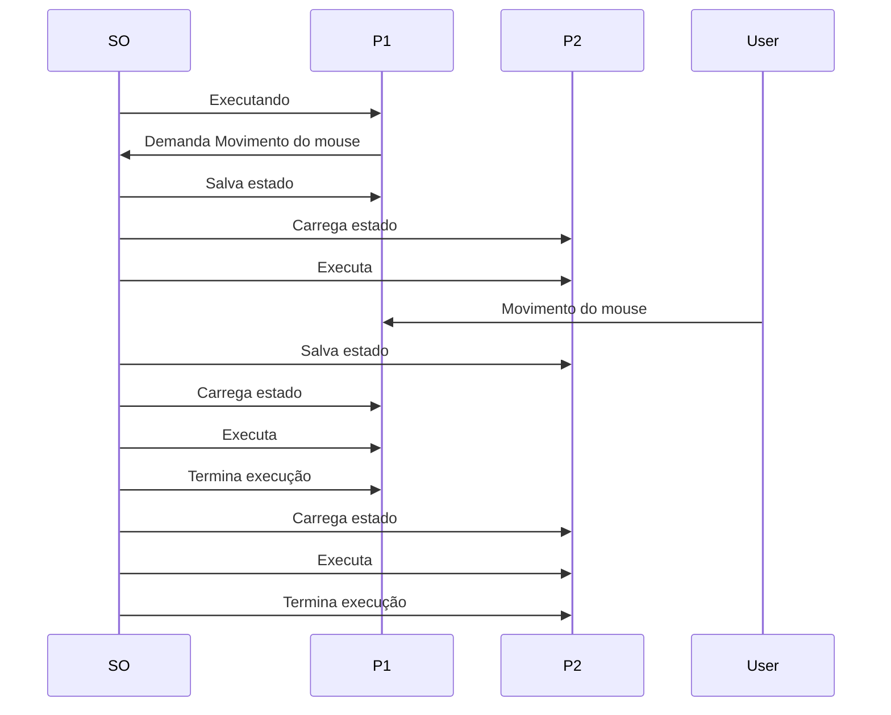
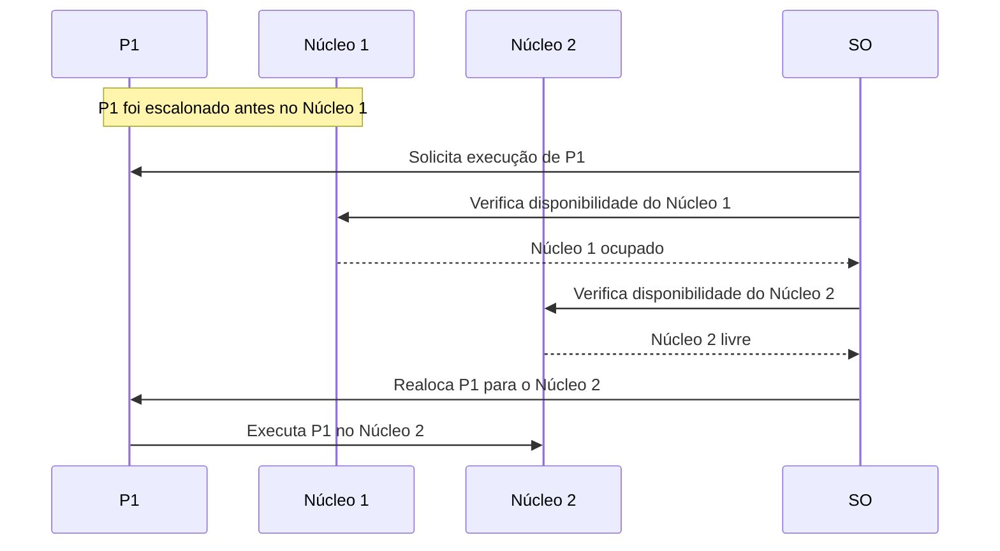
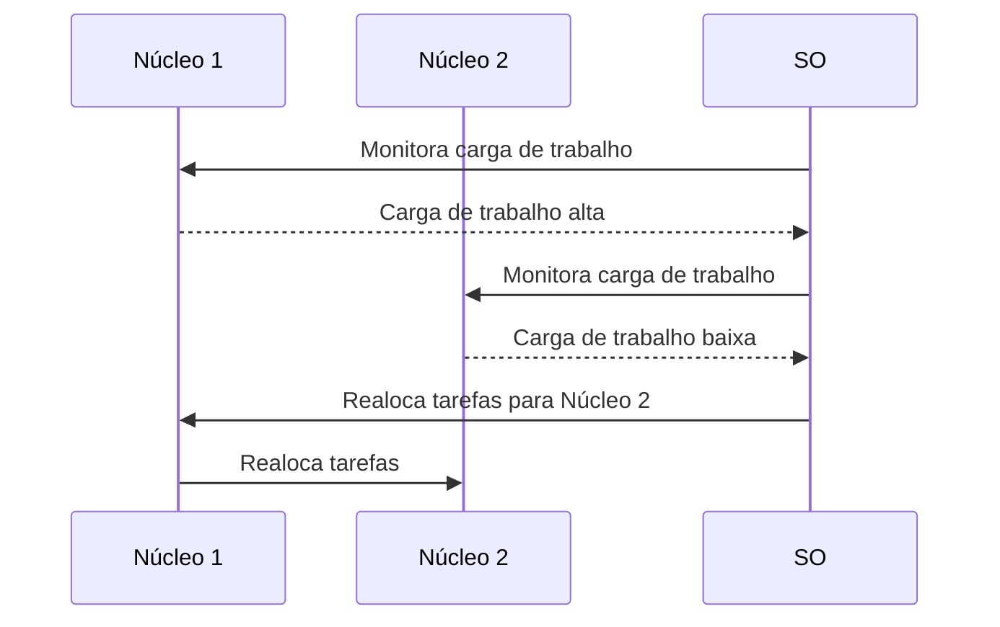

# Escalonamento de CPU

O escalonamento de CPU é uma técnica utilizada para alocar processos na CPU de forma eficiente. O escalonamento é uma das atividades mais importantes do sistema operacional, pois é responsável por decidir qual processo será executado em seguida.

---

## Sumário

- [O que é CPU?](#o-que-é-cpu)
- [O que é um processo?](#o-que-é-um-processo)
  - [Estados de um Processo](#estados-de-um-processo)
  - [Troca de Contexto do Processo](#troca-de-contexto-do-processo)
    - [Como funciona a troca de contexto?](#como-funciona-a-troca-de-contexto)
    - [Exemplo de troca de contexto](#exemplo-de-troca-de-contexto)
- [Compomentes do Escalonamento de CPU](#compomentes-do-escalonamento-de-cpu)
    - [Escalonador de CPU](#escalonador-de-cpu)
    - [Dispatcher](#dispatcher)
- [Critérios de Otimização de Escalonamento](#critérios-de-otimização-de-escalonamento)
- [Algoritmos de Escalonamento de CPU](#algoritmos-de-escalonamento-de-cpu)
  - [First-Come, First-Served (FCFS)](#first-come-first-served-fcfs)
  - [Shortest Job Next (SJN)](#shortest-job-next-sjn)
  - [Round Robin (RR)](#round-robin-rr)
  - [Prioridade de Processo](#prioridade-de-processo)
- [Alocação com Múltiplas Filas](#alocação-com-múltiplas-filas)
    - [Distinção de prioridade](#distinção-de-prioridade)
    - [Realimentação de prioridade](#realimentação-de-prioridade)
    - [Definição de Entrada de Processo](#definição-de-entrada-de-processo)
        - [Escalonamento de prioridade fixa](#escalonamento-de-prioridade-fixa)
        - [Fatia de tempo](#fatia-de-tempo)
- [Escalonamento de Threads](#escalonamento-de-threads)
    - [Escalonamento de Threads vs Escalonamento de Processos](#escalonamento-de-threads-vs-escalonamento-de-processos)
- [Escalonamento em Sistemas Multicore](#escalonamento-em-sistemas-multicore)
    - [Multiprocessamento Assimétrico](#multiprocessamento-assimétrico)
    - [Multiprocessamento Simétrico](#multiprocessamento-simétrico)
    - [Afinidade de CPU](#afinidade-de-cpu)
- [Conceitos Importantes](#conceitos-importantes)
    - [Quantum de Tempo](#quantum-de-tempo)
    - [Starvation](#starvation)
    - [Preempção](#preempção)

---

## O que é CPU?

A CPU, ou Unidade Central de Processamento, ou processador,  é um componente de hardware fundamental para o funcionamento de um computador, sendo considerada o seu cérebro. 
A CPU é responsável por fornecer instruções aos principais componentes do sistema, como a placa gráfica e a RAM.

---

## O que é um processo?

Um processo é um programa em execução. Ele é composto por um conjunto de instruções, dados e contexto de execução. O contexto de execução é composto por informações como registradores, ponteiro de instrução, pilha, etc.

### Estados de um Processo

- **Pronto**: O processo está pronto para ser executado, mas ainda não foi alocado na CPU.

- **Executando**: O processo está sendo executado na CPU.

- **Espera/Bloqueado**: O processo está esperando por algum evento externo ou recurso.

### Troca de Contexto do Processo

É o processo pelo qual o sistema operacional salva o estado de um processo em execução e carrega o estado de outro processo para ser executado pela CPU. Esse mecanismo é essencial para sistemas multitarefa, onde vários processos precisam compartilhar o tempo de CPU.

#### Como funciona a troca de contexto?

1. Salvamento do estado do processo atual.
   > Quando um processo é interrompido, o sistema operacional salva o estado atual do processo. Esse estado inclui:
   > - Registradores da CPU: o conteúdo dos registradores
   > - InformaçÕes de controle: [estado do processo](#estados-de-um-processo) e outras informações armazenadas no bloco de controle de processo (PCB).
2. Carregamento do estado do próximo processo.
   >  O sistema operacional, então, seleciona outro processo da fila de prontos para ser executado. O estado desse processo é restaurado, o que inclui carregar seus registradores, a posição da pilha e outros dados necessários para que o processo continue do ponto em que parou.

3. Continuação da execução.
    > Após a troca de contexto, o processo continua a execução a partir do ponto em que foi interrompido.

#### Exemplo de troca de contexto

Suponha que temos dois processos, P1 e P2, e que P1 seja prioritário e está sendo executado na CPU. Quando P1 demanda um movimento de mouse, o sistema operacional interrompe a execução de P1 e salva o estado atual do processo. Em seguida, o sistema operacional carrega o estado do processo P2 e o executa. Quando P1 recebe o movimento do mouse, o sistema operacional salva o estado de P2 e carrega o estado de P1, que continua a execução a partir do ponto em que foi interrompido. Quando P1 termina a execução, o sistema operacional carrega o estado de P2 e o executa.

---

## Compomentes do Escalonamento de CPU

### Escalonador de CPU

O escalonador de CPU é um componente do sistema operacional responsável por decidir qual processo será executado em seguida. 

### Dispatcher

O dispatcher é um componente do sistema operacional responsável por realizar a [troca de contexto](#troca-de-contexto-do-processo), ou seja, carregar o estado de um processo na CPU e iniciar a execução do processo. O dispatcher é chamado pelo escalonador de CPU após a seleção de um processo para execução.

---

## Critérios de Otimização de Escalonamento

Os critérios de escalonamento determinam a eficiência dos algoritmos de escalonamento e o desempenho do sistema. Alguns critérios importantes são:

- **Utilização da CPU**: A CPU deve ser mantida ocupada o máximo possível.

- **Taxa de Transferência(Throughput)**: Número de processos completados em um determinado período de tempo.

- **Tempo de Processamento(Turnaround)**: Tempo necessário para a conclusão de um processo, desde a submissão até a conclusão.

- **Tempo de Espera**: Tempo que um processo passa na fila de [prontos](#estados-de-um-processo).

- **Tempo de Resposta**: Tempo necessário para o sistema responder a uma solicitação.

---

## Algoritmos de Escalonamento de CPU

Existem vários algoritmos de escalonamento de CPU, cada um com suas próprias características e critérios de otimização.

### First-Come, First-Served (FCFS)

O algoritmo FCFS é um dos mais simples algoritmos de escalonamento de CPU. Neste algoritmo, os processos são executados na ordem em que chegam à fila de prontos. O primeiro processo a chegar é o primeiro a ser executado.

```mermaid
gantt
        dateFormat HH:mm
    axisFormat %H:%M
    section Processos
        P1 :a1, 00:00, 3m
        P2 :a2, after a1, 1m
        P3 :a3, after a2, 2m
```

De acordo com o gráfico acima, o processo P1 chega primeiro e é executado por 3 minutos. Em seguida, o processo P2 é executado por 1 minuto e, finalmente, o processo P3 é executado por 2 minutos.

Sua desvantagem é que processos de longa duração podem bloquear a execução de processos de curta duração. 

### Shortest Job Next (SJN)

O algoritmo SJN seleciona o processo com o menor tempo de execução restante para ser executado em seguida.

```mermaid
gantt
        dateFormat HH:mm
    axisFormat %H:%M
    section Processos
        P3 :a1, 00:00, 1m
        P1 :a2, after a1, 2m
        P2 :a3, after a2, 3m
```

De acordo com o gráfico acima, o processo P1 é executado primeiro, pois tem o menor tempo de execução. Em seguida, o processo P2 é executado e, finalmente, o processo P3.

Sua desvantagem é que processos de longa duração podem ficar bloqueados indefinidamente se houver processos de curta duração chegando constantemente. Havendo a possibilidade de [starvation](#starvation) de processos.

### Round Robin (RR)

Neste algoritmo, cada processo é executado por um pequeno intervalo de tempo chamado de [quantum](#quantum-de-tempo). Após o término do quantum, o processo é interrompido e colocado no final da fila de prontos. O próximo processo na fila é então executado.

Exemplo de escalonamento Round Robin com quantum de 2 unidades de tempo:

```mermaid
gantt
        dateFormat HH:mm
    axisFormat %H:%M
    section Processos
        P1 :a1, 00:00, 2m
        P2 :a2, after a1, 2m
        P3 :a3, after a2, 2m
        P1 :a4, after a3, 2m
        P1 :a5, after a4, 2m
```

De acordo com o gráfico acima, o processo P1 é executado por 2 unidades de tempo e, em seguida, interrompido. O processo P2 é executado por 2 unidades de tempo e, em seguida, o processo P3 é executado. O processo P1 é então retomado e executado por mais 2 unidades de tempo.

Sua desvantagem é que processos de longa duração podem ter um tempo de resposta alto, pois precisam esperar até que todos os outros processos sejam executados.

### Prioridade de Processo

Neste algoritmo, cada processo é atribuído uma prioridade. O processo com a maior prioridade é executado em seguida. 

Sua desvantagem é que processos de baixa prioridade podem sofrer de [starvation](#starvation) se houver processos de alta prioridade chegando constantemente. Porém, é possível implementar um mecanismo de envelhecimento de prioridade(Aging) para evitar o [starvation](#starvation), aumentando a prioridade de processos que esperam por muito tempo.

---

## Alocação com Múltiplas Filas

Em sistemas de escalonamento com múltiplas filas, os processos são divididos em várias filas de acordo com sua prioridade. Cada fila tem seu próprio algoritmo de escalonamento. 

- Fila 1: Algoritmo [Round Robin](#round-robin-rr) com [quantum](#quantum-de-tempo) de 2 unidades de tempo.

- Fila 2: Algoritmo [SJN](#shortest-job-next-sjn).

```mermaid
gantt
        dateFormat HH:mm
    axisFormat %H:%M
    section Fila 1
        P1 :a1, 00:00, 2m
        P2 :a2, after a1, 2m
        P1 :a3, after a2, 2m
        P2 :a4, after a3, 2m
    section Fila 2
        P3 :a5, after a4, 1m
        P4 :a6, after a5, 2m
```

De acordo com o gráfico acima, os processos P1 e P2 são executados na Fila 1 com o algoritmo Round Robin. Os processos P3 e P4 são executados na Fila 2 com o algoritmo SJN.

### Distinção de prioridade

O sistema pode distinguir entre processos interativos (que requerem respostas rápidas, como interfaces de usuário) e processos batch (que executam grandes cálculos sem necessidade de resposta imediata). Processos interativos são atribuídos a filas de alta prioridade, enquanto processos batch entram em filas de prioridade mais baixa.

### Realimentação de prioridade

Em sistemas de escalonamento com múltiplas filas, a prioridade de um processo pode ser ajustada com base em seu comportamento. Por exemplo, um processo que espera por muito tempo pode ter sua prioridade aumentada para evitar o [starvation](#starvation). Passando a ser executado em uma fila de prioridade mais alta. Também é possível diminuir a prioridade de processos que consomem muitos recursos.

### Definição de Entrada de Processo

#### Escalonamento de prioridade fixa

Cada processo é atribuído a uma fila com base em sua prioridade. Processos com alta prioridade (como processos de sistema ou de tempo real) entram em filas de prioridade mais alta, enquanto processos com prioridade mais baixa (como processos de usuário ou em background) entram em filas de prioridade mais baixa.

Um exemplo de sistema de escalonamento com múltiplas filas de prioridade:

Um processo que gerencia o sistema de arquivos ou serviços críticos pode ser colocado em uma fila de alta prioridade, enquanto um processo que edita um documento pode ser colocado em uma fila de prioridade mais baixa.

#### Fatia de tempo

Em sistemas com múltiplas filas, os processos podem ser categorizados com base em quanto tempo de CPU eles consomem. Processos que requerem pequenos tempos de CPU podem entrar em filas específicas para processos interativos (pequenos "bursts" de CPU), enquanto processos que precisam de longos tempos de CPU podem ser colocados em filas de baixa prioridade, dedicadas a tarefas em segundo plano.

---

## Escalonamento de Threads

Em sistemas operacionais modernos, os processos são compostos por threads, que são unidades de execução independentes dentro de um processo. O escalonamento de threads é semelhante ao escalonamento de processos, mas com algumas diferenças importantes. 

### Escalonamento de Threads vs Escalonamento de Processos

- **Escalabilidade**: Threads são mais leves e mais fáceis de criar e destruir do que processos. Isso permite que o sistema operacional gerencie um grande número de threads de forma eficiente.

- **Compartilhamento de Recursos**: Threads compartilham o mesmo espaço de endereço e recursos do processo pai. Isso facilita a comunicação e a sincronização entre threads.

## Escalonamento em Sistemas Multicore

Em sistemas multicore, o escalonamento de CPU é mais complexo, pois existem várias CPUs disponíveis para executar processos. O sistema operacional deve decidir em qual núcleo de CPU um processo será executado.

Uma grande desvantagem é que mover um processo de um núcleo para outro pode causar uma perda de desempenho devido à perda de afinidade de cache. 
> A afinidade de cache é a capacidade de um processo de acessar dados armazenados no cache de um núcleo específico.

### Multiprocessamento Assimétrico

Cada núcleo de CPU tem uma função específica. Por exemplo, um núcleo pode ser dedicado a tarefas de sistema, enquanto outro núcleo pode ser dedicado a tarefas de usuário. O escalonamento de CPU em sistemas de multiprocessamento assimétrico deve levar em consideração as características de cada núcleo.

### Multiprocessamento Simétrico

Todos os núcleos de CPU têm a mesma função e podem executar qualquer tipo de tarefa. O escalonamento de CPU em sistemas de multiprocessamento simétrico deve distribuir as tarefas de forma equitativa entre os núcleos.

> O escalonamento de tarefas, funciona de forma semelhante ao escalonamento de processos, mas com a diferença de que as tarefas podem ser executadas em qualquer núcleo de CPU disponível.

### Afinidade de CPU

É a capacidade de um processo ou thread de ser executado em um núcleo de CPU específico. A afinidade de CPU pode ser usada para otimizar o desempenho do sistema, alocando tarefas a núcleos específicos com base em suas características.

### Alocação de Processos em Sistemas Multicore

Em sistemas multicore, o escalonamento de CPU deve levar em consideração a distribuição de tarefas entre os núcleos de CPU disponíveis. O sistema operacional deve decidir em qual núcleo de [CPU](#o-que-é-cpu) um processo será executado com base em vários critérios, como a carga de trabalho do núcleo, a [afinidade de CPU](#afinidade-de-cpu) do processo e a otimização do desempenho do sistema.

#### Escalonamento com Afinidade

- Imagine que temos um processo P1 que executou várias vezes no núcleo 1, e um processo P2 que foi escalonado no núcleo 2.
- Se P1 for escalonado novamente, o sistema preferirá colocá-lo no núcleo 1 devido à afinidade de CPU (suas informações ainda podem estar no cache daquele núcleo).
- Se o núcleo 1 estiver ocupado e o núcleo 2 estiver livre, o sistema poderá mover P1 para o núcleo 2, sacrificando a afinidade de cache para evitar ociosidade.

#### Balanceamento de Carga

- O balanceamento de carga é um mecanismo usado para distribuir tarefas de forma equitativa entre os núcleos de CPU disponíveis.

- O sistema operacional monitora a carga de trabalho de cada núcleo e redistribui as tarefas conforme necessário para garantir que todos os núcleos sejam utilizados de forma eficiente.

- O balanceamento de carga pode ser feito de forma estática (com base em regras predefinidas) ou dinâmica (com base na carga de trabalho em tempo real).

Se o núcleo 1 tiver uma fila de processos muito longa e o núcleo 2 estiver subutilizado, o sistema pode decidir transferir alguns processos do núcleo 1 para o núcleo 2, a fim de equilibrar a carga.

#### Escalonamento Global e Escalonamento Local

- No escalonamento global, todos os núcleos compartilham uma única fila global de processos prontos para serem executados. O sistema escolhe um processo da fila e o aloca para qualquer núcleo disponível.

- No escalonamento local, cada núcleo possui sua própria fila de processos. O núcleo executa os processos de sua fila local, evitando a troca entre diferentes núcleos.

## Conceitos Importantes

### Quantum de Tempo

É o intervalo de tempo durante o qual um processo é executado na CPU. O quantum é uma constante definida pelo sistema operacional e pode variar de acordo com o sistema.

### Starvation

É um problema em sistemas de escalonamento de CPU em que um processo não recebe a CPU por um longo período de tempo devido a processos de maior prioridade. Isso pode levar a um tempo de resposta alto para o processo e a uma degradação do desempenho do sistema.

### Preempção

Escalonamento preemptivo é um tipo de escalonamento em que o sistema operacional pode interromper a execução de um processo em andamento para executar outro processo de maior prioridade. Isso é feito por meio de interrupções de hardware ou software. Quando dizemos que um escalonamento é não-preemptivo, significa que uma vez que um processo começa a ser executado na CPU, ele não pode ser interrompido até que termine ou voluntariamente ceda o controle da CPU, como ao solicitar uma operação de entrada/saída ou completar sua execução.