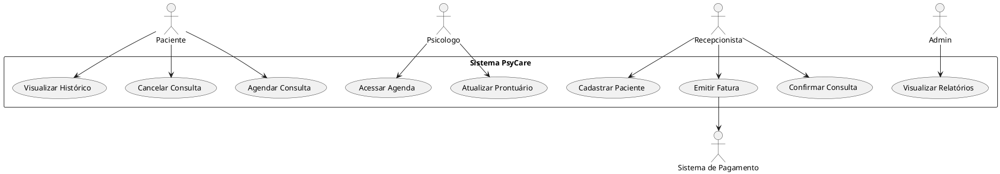
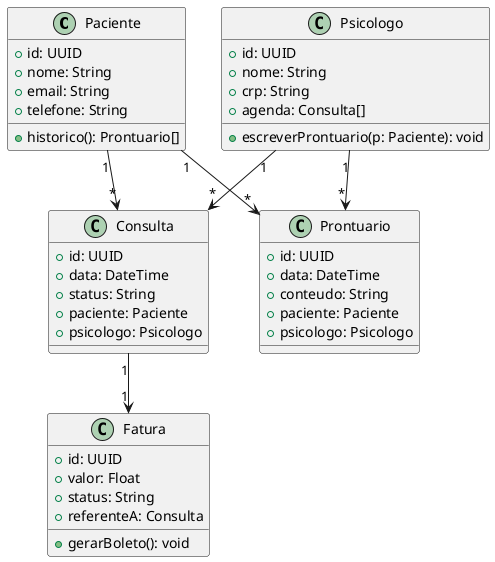

# Atividade 06/17

Você foi contratado(a) por uma organização (real ou fictícia) para projetar um Sistema de Informação que resolva um problema específico dessa entidade.

Escolha uma organização e defina um cenário prático para projetar um sistema de informação que atenda uma necessidade real.

# 1 - Descreva o ambiente no qual o sistema será inserido e identifique os atores que interagem com o sistema.

**Ambiente:**  
O sistema será utilizado em clínicas de psicologia que oferecem consultas presenciais e online. As clínicas possuem psicólogos fixos e atendem pacientes com diferentes convênios. O sistema será acessado via navegador por computadores e tablets dentro da clínica, além de acesso remoto pelos pacientes.

**Atores:**
- **Paciente:** agenda consultas, acessa histórico e prontuários.
- **Psicólogo:** gerencia agenda, acessa e atualiza prontuários.
- **Recepcionista:** realiza cadastros, agendamentos, confirmações e pagamentos.
- **Administrador da clínica:** visualiza relatórios e gerencia profissionais.
- **Sistema de Pagamento (externo):** integra com gateway para cobranças.

---

# 2 - Liste ao menos 5 requisitos funcionais e 3 requisitos não funcionais.

**Requisitos Funcionais:**
1. Permitir cadastro e login de pacientes e psicólogos.
2. Agendamento e cancelamento de consultas.
3. Registro e consulta de prontuários por psicólogos.
4. Geração de faturas e confirmação de pagamentos.
5. Relatórios mensais de atendimentos e receita.

**Requisitos Não Funcionais:**
- O sistema deve estar disponível 99,5% do tempo.
- O acesso deve ser seguro (HTTPS + autenticação JWT).
- Tempo de resposta para qualquer ação deve ser inferior a 2 segundos.

# 3 - Escolha um padrão de arquitetura (ou combinação de padrões): MVC, Camadas, Repositório, Cliente-Servidor, Duto e Filtro. Justifique a escolha com base nos requisitos.

**Padrões escolhidos:**  
- **MVC**
- **Repositório**
- **Cliente-Servidor**

**Justificativa:**

- **MVC (Model-View-Controller):**  
  Separa a lógica de negócio (**Model**), a interface (**View**) e o controle (**Controller**), facilitando a manutenção e os testes.

- **Repositório:**  
  Abstrai o acesso aos dados, isolando a lógica de persistência e facilitando mudanças de banco de dados.

- **Cliente-Servidor:**  
  Essencial, pois o sistema será acessado remotamente. O backend será responsável pela lógica e o frontend funcionará como interface web.

# 4 - Diagrama de Casos de Uso com pelo menos 3 casos principais e seus atores (inserir link para o diagrama).

# 5 - Diagrama de Classes com os principais objetos, atributos, métodos e relacionamentos
