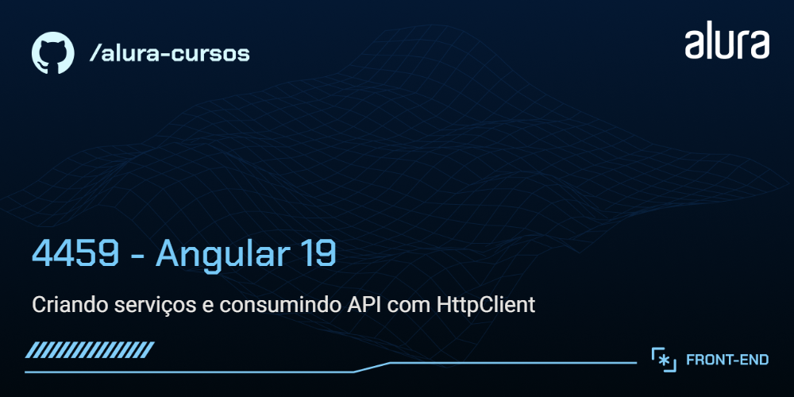

# Organo

O Organo é um aplicativo organizador de leituras que permite listar criar, editar, excluir e favoritar livros.

## 🔨 Funcionalidades do projeto

`Listagem de livros`: Exibe uma lista de livros, separados por gênero literário, exibindo a imagem e demais informações.

`Cadastro de livros`: Permite adicionar novos livros ao sistema, enviando os dados para a API.

`Edição e exclusão de livros`: Possibilita modificar e remover livros da lista através de interações com a API.

`Favoritar livros`: Adiciona a funcionalidade de favoritar livros, permitindo destacar títulos preferidos.

## ✔️ Técnicas e tecnologias utilizadas

O desenvolvimento do projeto utilizou as seguintes técnicas e tecnologias:

`Angular`: Framework utilizado para construir a aplicação, na versão 19.

`CLI do Angular`: Ferramenta de linha de comando para agilizar a criação e organização do projeto.

`Componentização`: Estrutura modular e reutilizável que define a base da aplicação.

`Diretiva ngClass`: Aplicação de classes CSS dinamicamente para estilização condicional.

`Templates`: Utilização de Bindings (one-way), eventos e interpolação para criar interfaces dinâmicas e responsivas.

`Controle de Fluxo`: Uso de @if e @for para controlar a exibição e iteração de elementos na interface.

`Inputs com Signals`: Comunicação eficiente entre componentes utilizando a API de Signals.

`Injeção de dependências (DI)`: Utilização do sistema de DI do Angular para gerenciar serviços.

`Serviços Angular`: Criação e configuração de serviços injetáveis para separação da lógica de comunicação com a API.

`HttpClient`: Consumo de APIs REST para listar, adicionar, editar e excluir livros.

`Requisições HTTP`: Implementação das operações GET, POST, PUT, PATCH e DELETE para manipulação de dados.

`Observables e RxJS`: Uso do padrão Observer para tratar dados assíncronos e resposta de requisições HTTP.

`Tratamento de erros`: Implementação de interceptores para capturar erros de requisição e exibir mensagens amigáveis na interface.

`Interceptor HTTP`: Configuração para modificar requisições e respostas e tratar erros globalmente.

`JSON Server`: Simulação de um backend para armazenar e gerenciar os dados do projeto.

## 📁 Link do Figma

Você pode [acessar o figma do projeto aqui](https://www.figma.com/community/file/1473330944329863214).

## 🛠️ Abrir e rodar o projeto

Requisitos:
Node.js (versão 18 ou superior).
Angular 19 (caso não tenha, instale com npm install -g @angular/cli@19).
JSON Server (versão 0.17.4)

Após baixar o projeto, você precisa instalar as dependências utilizando o comando:
```bash
npm install
```
Iniciar o backend (JSON Server):
```bash
cd backend
npm start
```

Depois, para executar o projeto em modo desenvolvimento:
```bash
ng serve
```
Então, acesse [http://localhost:4200/](url) no seu navegador.
