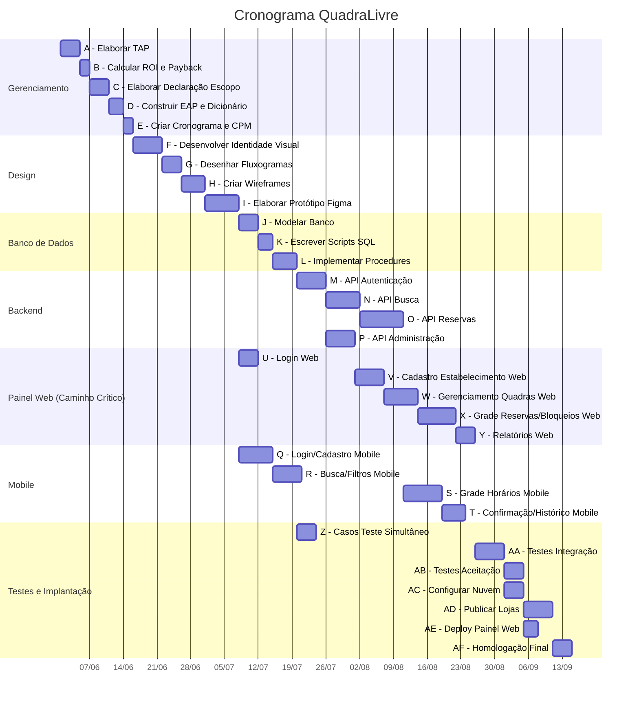

# Cronograma de Atividades e Caminho Crítico (CPM)

## 1. Lista de Atividades com Verbos de Ação

As atividades abaixo foram derivadas dos pacotes de trabalho da EAP e descritas utilizando verbos de ação no infinitivo. Cada atividade possui um ID único, descrição, precedência e estimativas de duração (em dias úteis).

| ID | Atividade | Pacote EAP | Predecessora |
|----|-----------|------------|--------------|
| A | Elaborar Termo de Abertura do Projeto (TAP) | 1.1.1 | -- |
| B | Calcular ROI e Payback Simples | 1.1.2 | A |
| C | Elaborar Declaração do Escopo | 1.2.1 | B |
| D | Construir EAP e Dicionário da EAP | 1.2.2 | C |
| E | Criar Cronograma e Identificar Caminho Crítico | 1.3 | D |
| F | Desenvolver Identidade Visual (Logo e Paleta) | 2.1.1 | E |
| G | Desenhar Fluxogramas de Navegação | 2.1.2 | F |
| H | Criar Wireframes de Baixa Fidelidade | 2.2.1 | G |
| I | Elaborar Protótipo de Alta Fidelidade (Figma) | 2.2.2 | H |
| J | Modelar Banco de Dados (Conceitual e Lógico) | 3.1.1 | I |
| K | Escrever Scripts SQL de Criação das Tabelas | 3.1.2 | J |
| L | Implementar Procedures e Índices de Concorrência | 3.1.3 | K |
| M | Desenvolver API de Autenticação | 3.2.1 | L |
| N | Desenvolver API de Busca de Quadras | 3.2.2 | M |
| O | Desenvolver API de Gerenciamento de Reservas | 3.2.3 | N |
| P | Desenvolver API de Administração | 3.2.4 | M |
| Q | Desenvolver Telas de Login e Cadastro (Mobile) | 3.3.1 | I |
| R | Desenvolver Tela de Busca e Filtros (Mobile) | 3.3.2 | Q |
| S | Desenvolver Tela de Grade de Horários (Mobile) | 3.3.3 | R, O |
| T | Desenvolver Tela de Confirmação e Histórico (Mobile) | 3.3.4 | S |
| U | Desenvolver Tela de Login (Painel Web) | 3.4.1 | I |
| V | Desenvolver Tela de Cadastro do Estabelecimento (Web) | 3.4.2 | U, P |
| W | Desenvolver Tela de Gerenciamento de Quadras e Preços (Web) | 3.4.3 | V |
| X | Desenvolver Tela de Grade de Reservas e Bloqueios (Web) | 3.4.4 | W, O |
| Y | Desenvolver Tela de Relatórios (Web) | 3.4.5 | X |
| Z | Elaborar Casos de Teste de Agendamento Simultâneo | 4.1.1 | L |
| AA | Executar Testes de Integração (API + Mobile + Web) | 4.1.2 | T, Y, Z |
| AB | Realizar Testes de Aceitação do Usuário | 4.1.3 | AA |
| AC | Configurar Infraestrutura em Nuvem | 4.2.1 | AA |
| AD | Publicar App nas Lojas (Android e iOS) | 4.2.2 | AC |
| AE | Realizar Deploy do Painel Web | 4.2.3 | AC |
| AF | Conduzir Homologação Final | 4.2.4 | AD, AE, AB |

## 2. Estimativas de Duração (PERT)

Para cada atividade, foram definidas três estimativas de duração em dias úteis:

- **O** (Otimista): menor duração possível
- **M** (Mais Provável): duração mais realista
- **P** (Pessimista): maior duração possível considerando riscos

A fórmula PERT utilizada para calcular a duração estimada (TE) é:

**TE = (O + 4M + P) / 6**

| ID | Atividade | O | M | P | TE (dias) |
|----|-----------|---|---|---|-----------|
| A | Elaborar TAP | 2 | 3 | 5 | 3,2 |
| B | Calcular ROI e Payback | 1 | 2 | 3 | 2,0 |
| C | Elaborar Declaração do Escopo | 2 | 3 | 5 | 3,2 |
| D | Construir EAP e Dicionário | 2 | 3 | 4 | 3,0 |
| E | Criar Cronograma e CPM | 1 | 2 | 3 | 2,0 |
| F | Desenvolver Identidade Visual | 3 | 5 | 8 | 5,2 |
| G | Desenhar Fluxogramas | 2 | 3 | 5 | 3,2 |
| H | Criar Wireframes | 3 | 4 | 6 | 4,2 |
| I | Elaborar Protótipo Figma | 4 | 6 | 10 | 6,3 |
| J | Modelar Banco de Dados | 2 | 4 | 6 | 4,0 |
| K | Escrever Scripts SQL | 1 | 2 | 4 | 2,2 |
| L | Implementar Procedures e Índices | 2 | 4 | 7 | 4,2 |
| M | Desenvolver API de Autenticação | 3 | 5 | 8 | 5,2 |
| N | Desenvolver API de Busca | 4 | 6 | 10 | 6,3 |
| O | Desenvolver API de Reservas | 5 | 8 | 14 | 8,5 |
| P | Desenvolver API de Administração | 3 | 5 | 8 | 5,2 |
| Q | Desenvolver Login/Cadastro Mobile | 4 | 6 | 10 | 6,3 |
| R | Desenvolver Busca/Filtros Mobile | 3 | 5 | 8 | 5,2 |
| S | Desenvolver Grade de Horários Mobile | 4 | 7 | 12 | 7,3 |
| T | Desenvolver Confirmação/Histórico Mobile | 3 | 4 | 7 | 4,3 |
| U | Desenvolver Login (Painel Web) | 2 | 3 | 5 | 3,2 |
| V | Desenvolver Cadastro Estabelecimento Web | 3 | 5 | 8 | 5,2 |
| W | Desenvolver Gerenciamento Quadras/Preços Web | 4 | 6 | 10 | 6,3 |
| X | Desenvolver Grade Reservas/Bloqueios Web | 4 | 7 | 12 | 7,3 |
| Y | Desenvolver Relatórios Web | 2 | 4 | 6 | 4,0 |
| Z | Elaborar Casos de Teste Simultâneo | 2 | 3 | 5 | 3,2 |
| AA | Executar Testes de Integração | 3 | 5 | 8 | 5,2 |
| AB | Realizar Testes de Aceitação | 2 | 3 | 5 | 3,2 |
| AC | Configurar Infraestrutura em Nuvem | 2 | 3 | 5 | 3,2 |
| AD | Publicar App nas Lojas | 3 | 5 | 10 | 5,5 |
| AE | Realizar Deploy do Painel Web | 1 | 2 | 3 | 2,0 |
| AF | Conduzir Homologação Final | 2 | 3 | 5 | 3,2 |

## 3. Gráfico de Gantt

O gráfico de Gantt a seguir ilustra o sequenciamento das atividades ao longo das 16 semanas do projeto, considerando as durações PERT calculadas e as estratégias de compressão aplicadas.

**Nota:** O formato Mermaid Gantt não suporta múltiplas predecessoras por atividade. As dependências completas estão documentadas na tabela da Seção 1. As atividades com dependências múltiplas (S, V, X, AA, AF) iniciam pela data mais tardia dentre suas predecessoras.

## 4. Caminho Crítico (CPM)

Para identificar o caminho crítico, foram calculados os seguintes parâmetros para cada atividade utilizando o método Forward Pass / Backward Pass:

- **IMC** (Início Mais Cedo): data mais cedo possível para iniciar a atividade
- **TMC** (Término Mais Cedo): IMC + duração da atividade
- **IMT** (Início Mais Tarde): data mais tarde para iniciar sem atrasar o projeto
- **TMT** (Término Mais Tarde): IMT + duração da atividade
- **Folga Total**: IMT − IMC (ou TMT − TMC)

O caminho crítico é composto pelas atividades com folga total igual a zero.

### 4.1 Forward Pass (Cálculo dos Inícios/Términos Mais Cedo)

| ID | Atividade | TE | IMC | TMC |
|----|-----------|----|-----|-----|
| A | Elaborar TAP | 3,2 | 0,0 | 3,2 |
| B | Calcular ROI e Payback | 2,0 | 3,2 | 5,2 |
| C | Elaborar Declaração do Escopo | 3,2 | 5,2 | 8,4 |
| D | Construir EAP e Dicionário | 3,0 | 8,4 | 11,4 |
| E | Criar Cronograma e CPM | 2,0 | 11,4 | 13,4 |
| F | Desenvolver Identidade Visual | 5,2 | 13,4 | 18,6 |
| G | Desenhar Fluxogramas | 3,2 | 18,6 | 21,8 |
| H | Criar Wireframes | 4,2 | 21,8 | 26,0 |
| I | Elaborar Protótipo Figma | 6,3 | 26,0 | 32,3 |
| J | Modelar Banco de Dados | 4,0 | 32,3 | 36,3 |
| K | Escrever Scripts SQL | 2,2 | 36,3 | 38,5 |
| L | Implementar Procedures | 4,2 | 38,5 | 42,7 |
| M | API de Autenticação | 5,2 | 42,7 | 47,9 |
| N | API de Busca | 6,3 | 47,9 | 54,2 |
| O | API de Reservas | 8,5 | 54,2 | 62,7 |
| P | API de Administração | 5,2 | 47,9 | 53,1 |
| Q | Login/Cadastro Mobile | 6,3 | 32,3 | 38,6 |
| R | Busca/Filtros Mobile | 5,2 | 38,6 | 43,8 |
| S | Grade Horários Mobile | 7,3 | 62,7 | 70,0 |
| T | Confirmação/Histórico Mobile | 4,3 | 70,0 | 74,3 |
| U | Login Web | 3,2 | 32,3 | 35,5 |
| V | Cadastro Estabelecimento Web | 5,2 | 53,1 | 58,3 |
| W | Gerenciamento Quadras/Preços Web | 6,3 | 58,3 | 64,6 |
| X | Grade Reservas/Bloqueios Web | 7,3 | 64,6 | 71,9 |
| Y | Relatórios Web | 4,0 | 71,9 | 75,9 |
| Z | Casos de Teste Simultâneo | 3,2 | 42,7 | 45,9 |
| AA | Testes de Integração | 5,2 | 75,9 | 81,1 |
| AB | Testes de Aceitação | 3,2 | 81,1 | 84,3 |
| AC | Configurar Infraestrutura Nuvem | 3,2 | 81,1 | 84,3 |
| AD | Publicar App nas Lojas | 5,5 | 84,3 | 89,8 |
| AE | Deploy Painel Web | 2,0 | 84,3 | 86,3 |
| AF | Homologação Final | 3,2 | 89,8 | 93,0 |

**Observações sobre os IMC com múltiplas predecessoras:**
- S: IMC = max(TMC de R=43,8; TMC de O=62,7) = **62,7**
- V: IMC = max(TMC de U=35,5; TMC de P=53,1) = **53,1**
- X: IMC = max(TMC de W=64,6; TMC de O=62,7) = **64,6**
- AA: IMC = max(TMC de T=74,3; TMC de Y=75,9; TMC de Z=45,9) = **75,9**
- AF: IMC = max(TMC de AD=89,8; TMC de AE=86,3; TMC de AB=84,3) = **89,8**

### 4.2 Identificação do Caminho Crítico

Após realizar o Backward Pass (partindo do término do projeto = 93,0 dias), as atividades com folga total = 0 compõem o caminho crítico:

**A → B → C → D → E → F → G → H → I → J → K → L → M → P → V → W → X → Y → AA → AC → AD → AF**

### 4.3 Duração Total do Caminho Crítico

| ID | Atividade | TE (dias) |
|----|-----------|-----------|
| A | Elaborar TAP | 3,2 |
| B | Calcular ROI e Payback | 2,0 |
| C | Elaborar Declaração do Escopo | 3,2 |
| D | Construir EAP e Dicionário | 3,0 |
| E | Criar Cronograma e CPM | 2,0 |
| F | Desenvolver Identidade Visual | 5,2 |
| G | Desenhar Fluxogramas | 3,2 |
| H | Criar Wireframes | 4,2 |
| I | Elaborar Protótipo Figma | 6,3 |
| J | Modelar Banco de Dados | 4,0 |
| K | Escrever Scripts SQL | 2,2 |
| L | Implementar Procedures | 4,2 |
| M | API de Autenticação | 5,2 |
| P | API de Administração | 5,2 |
| V | Cadastro Estabelecimento Web | 5,2 |
| W | Gerenciamento Quadras/Preços Web | 6,3 |
| X | Grade Reservas/Bloqueios Web | 7,3 |
| Y | Relatórios Web | 4,0 |
| AA | Testes de Integração | 5,2 |
| AC | Configurar Infraestrutura Nuvem | 3,2 |
| AD | Publicar App nas Lojas | 5,5 |
| AF | Homologação Final | 3,2 |
| **Total** | | **93,0 dias (~18,6 semanas)** |

### 4.4 Interpretação do Caminho Crítico

O caminho crítico do projeto QuadraLivre concentra-se nas atividades de gerenciamento, design, banco de dados, API de Administração e, de forma central, no desenvolvimento do **painel web** (V → W → X → Y). O gargalo do projeto está na sequência do frontend web, que depende da conclusão da API de Administração e acumula mais duração total do que a trilha mobile.

A trilha mobile (N → O → S → T) possui folga de apenas 1,6 dias, configurando um **caminho quase-crítico** que demanda atenção do gerente de projeto.

### 4.5 Atividades com Folga (Fora do Caminho Crítico)

| ID | Atividade | TE (dias) | Folga Total (dias) | Observação |
|----|-----------|-----------|-------------------|------------|
| N | API de Busca | 6,3 | 1,6 | Caminho quase-crítico; alimenta O e indiretamente S |
| O | API de Reservas | 8,5 | 1,6 | Caminho quase-crítico; necessária para S e X |
| S | Grade Horários Mobile | 7,3 | 1,6 | Depende de R e O; caminho quase-crítico |
| T | Confirmação/Histórico Mobile | 4,3 | 1,6 | Alimenta AA; caminho quase-crítico |
| Q | Login/Cadastro Mobile | 6,3 | 20,5 | Inicia após I, independente do backend |
| R | Busca/Filtros Mobile | 5,2 | 20,5 | Dependente apenas de Q |
| U | Login Web | 3,2 | 17,6 | Inicia após I; V depende de P (que governa) |
| Z | Casos de Teste Simultâneo | 3,2 | 30,0 | Inicia após L, bastante antecipável |
| AB | Testes de Aceitação | 3,2 | 5,5 | Dependente de AA |
| AE | Deploy Painel Web | 2,0 | 3,5 | Dependente de AC; AF espera AD (mais longo) |

### 4.6 Ajuste para 16 Semanas (Estratégia de Compressão)

O cronograma teórico resulta em 93,0 dias (~18,6 semanas), excedendo o limite de 16 semanas (80 dias úteis) em **13 dias**. As seguintes estratégias de compressão serão aplicadas:

**1. Fast-tracking (Paralelismo Ampliado):**
- Iniciar V (Cadastro Estabelecimento Web) parcialmente em paralelo com P (API Administração), utilizando mocks das APIs durante o desenvolvimento do frontend. Redução estimada: **4 dias**.
- Iniciar X (Grade Reservas/Bloqueios Web) antes da conclusão total de W, trabalhando nos componentes de visualização enquanto a lógica de preços é finalizada. Redução estimada: **3 dias**.

**2. Crashing (Alocação de Recurso Adicional):**
- Alocar desenvolvedor mobile como suporte no pacote X (Grade Reservas/Bloqueios Web), que é a atividade mais longa do caminho crítico no frontend web (7,3 dias → estimativa reduzida para 5 dias). Redução: **2,3 dias**.

**3. Redução de Escopo Interno:**
- Simplificar Y (Relatórios Web): entregar apenas relatório de reservas na v1, postergando relatório de faturamento para iteração seguinte. Redução: **2 dias** (de 4,0 para 2,0 dias).

**4. Paralelismo Backend-Frontend:**
- As equipes de backend e frontend mobile/web trabalham simultaneamente a partir da aprovação do protótipo (atividade I), com o backend priorizando a API de Administração (P) sobre a API de Busca (N) para destravar o caminho crítico mais cedo.

**Resultado após compressão:** Redução total estimada de ~11,3 dias + margem de 1,7 dias absorvida pela folga do caminho quase-crítico (N→O→S→T). Duração efetiva do projeto: **~80 dias úteis**, compatível com o limite de 16 semanas.

## 5. Conclusão

O caminho crítico do projeto QuadraLivre está concentrado no desenvolvimento do painel web administrativo (atividades P, V, W, X e Y), que depende da API de Administração e acumula a maior duração total da rede de atividades. Este é o gargalo do projeto e deve receber atenção prioritária do gerente de projeto. Qualquer atraso nas atividades do caminho crítico impacta diretamente a data de entrega final.

O caminho quase-crítico (N → O → S → T, com folga de apenas 1,6 dias) também exige monitoramento constante, pois qualquer desvio superior a 1,6 dias nessas atividades transforma o caminho mobile no novo caminho crítico.

As atividades com folga significativa (como Q, R, U e Z) oferecem margem para realocação de recursos e absorção de pequenos desvios sem comprometer o prazo do projeto.
