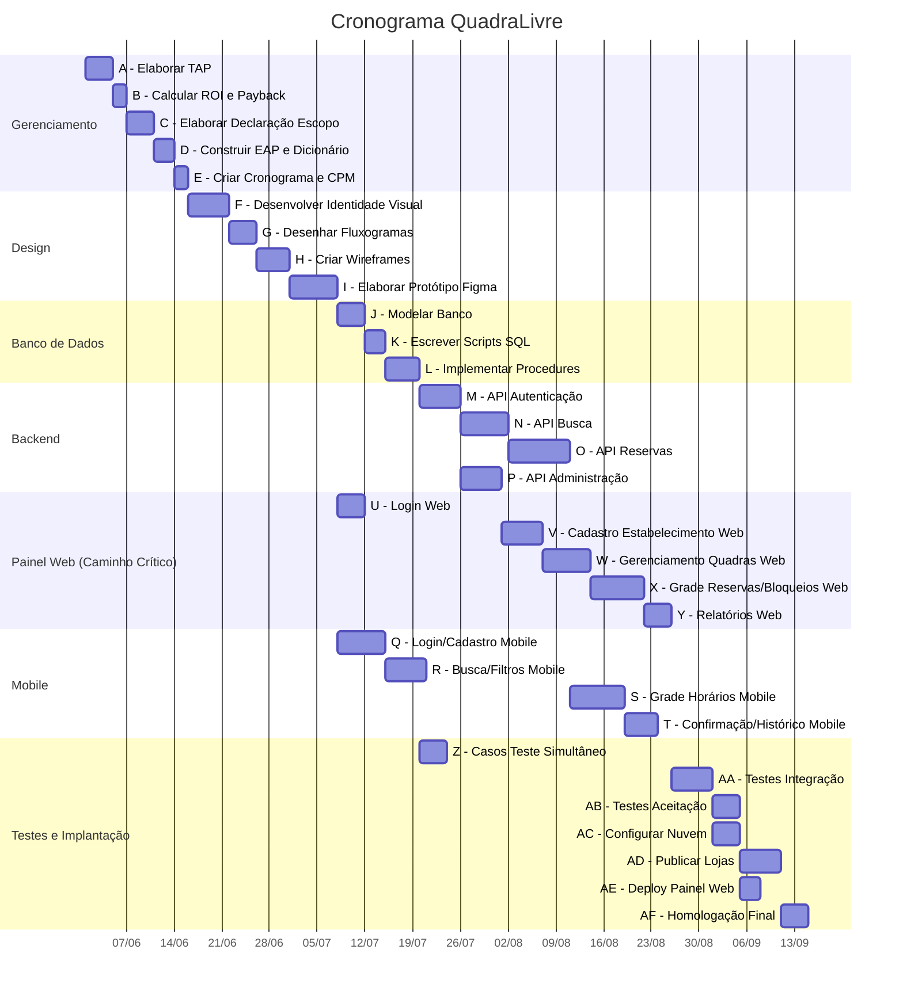

<div class="cover">

# QuadraLivre

## Plataforma de Aluguel de Quadras Esportivas

### Documento de Gerenciamento de Projeto

<br><br><br>

**Autores:**

Victor Hugo Vieira Cruz

Filipe Moreira Coelho

<br><br>

**Disciplina:** Gerência de Projetos de Software

**Período:** 7º Período — Bacharelado em Sistemas de Informação

**Data:** Junho de 2026

</div>

# Sumário

1. [Termo de Abertura do Projeto (TAP) e Análise de Viabilidade](#1-termo-de-abertura-do-projeto-tap-e-análise-de-viabilidade)
2. [Declaração do Escopo do Projeto](#2-declaração-do-escopo-do-projeto)
3. [Estrutura Analítica do Projeto (EAP) e Dicionário](#3-estrutura-analítica-do-projeto-eap-e-dicionário-da-eap)
4. [Cronograma de Atividades e Caminho Crítico (CPM)](#4-cronograma-de-atividades-e-caminho-crítico-cpm)
5. [Referência ao Protótipo](#5-referência-ao-protótipo)

<div class="page-break"></div>

# 1. Termo de Abertura do Projeto (TAP) e Análise de Viabilidade

## 1.1 Identificação do Projeto

| Campo | Descrição |
|-------|-----------|
| Nome do Projeto | QuadraLivre - Plataforma de Aluguel de Quadras Esportivas |
| Gerentes do Projeto | Victor Hugo Vieira Cruz e Filipe Moreira Coelho |
| Cliente | Donos de quadras esportivas e usuários praticantes de esportes |
| Data de Emissão | 02 de Junho de 2026 |
| Versão | 1.0 |

## 1.2 Justificativa de Negócio

O mercado de aluguel de quadras esportivas no Brasil é fragmentado e predominantemente analógico. A maioria dos estabelecimentos ainda opera por meio de ligações telefônicas ou mensagens de WhatsApp para gerenciar reservas, o que gera ineficiências como dupla reserva, horários ociosos não preenchidos e dificuldade de escalabilidade. O cliente final, por sua vez, enfrenta dificuldade para encontrar quadras disponíveis, comparar preços e confirmar reservas de forma rápida.

A QuadraLivre surge como uma plataforma digital que automatiza todo o ciclo de reserva: o usuário busca quadras por localização e modalidade, visualiza a grade de horários em tempo real e confirma a reserva instantaneamente; o dono da quadra gerencia preços, horários e bloqueios por meio de um painel web. O projeto se justifica pelo potencial de redução do tempo ocioso das quadras em até 30%, aumento do faturamento dos estabelecimentos e melhoria significativa da experiência do usuário final, que elimina intermediários manuais.

## 1.3 Objetivos do Projeto

- Desenvolver um aplicativo mobile para que usuários encontrem e reservem quadras esportivas em tempo real.
- Desenvolver um painel web para que administradores gerenciem seus estabelecimentos, quadras, preços e horários.
- Implementar um sistema de reservas com confirmação imediata e controle de concorrência para evitar duplicidade.
- Entregar o MVP em até 4 meses com as funcionalidades essenciais de busca, reserva e gestão.

## 1.4 Marcos Principais do Projeto

| Marco | Descrição | Data Prevista |
|-------|-----------|---------------|
| M1 | Aprovação do TAP e Viabilidade | Semana 1 |
| M2 | Declaração do Escopo e EAP concluídos | Semana 2 |
| M3 | Protótipo de alta fidelidade aprovado (Figma) | Semana 4 |
| M4 | Modelagem do banco de dados concluída | Semana 5 |
| M5 | Backend (APIs de busca e reserva) concluído | Semana 9 |
| M6 | Frontend web (painel do dono) concluído | Semana 11 |
| M7 | Frontend mobile (app do jogador) concluído | Semana 13 |
| M8 | Testes de agendamento simultâneo concluídos | Semana 14 |
| M9 | Homologação e publicação | Semana 16 |

## 1.5 Orçamento Preliminar

| Item | Custo Estimado (R$) |
|------|---------------------|
| Recursos Humanos (4 profissionais × 4 meses) | 48.000,00 |
| Ferramentas e Infraestrutura (servidores, licenças, design) | 7.200,00 |
| Custos Operacionais (energia, internet, deslocamento) | 2.400,00 |
| Taxas de publicação nas lojas (Apple e Google) | 400,00 |
| Contingenciamento (10%) | 5.800,00 |
| **Total** | **63.800,00** |

## 1.6 Análise de Viabilidade Econômica

### 1.6.1 Premissas Adotadas

- Custo total do projeto (investimento inicial): R$ 63.800,00
- Custo operacional mensal estimado (servidores, manutenção, suporte): R$ 2.500,00
- Modelo de receita: assinatura mensal de R$ 97,00 por estabelecimento + taxa de 10% sobre o valor de cada reserva
- Número de estabelecimentos captados no primeiro ano: 15
- Média de reservas por estabelecimento por mês: 80
- Valor médio por reserva: R$ 100,00
- Horizonte de análise: 12 meses

### 1.6.2 Projeção de Receita Mensal

| Fonte | Cálculo | Valor (R$) |
|-------|---------|------------|
| Assinaturas (15 estabelecimentos × R$ 97,00) | 15 × 97,00 | 1.455,00 |
| Taxa sobre reservas (15 × 80 × R$ 100,00 × 10%) | 15 × 80 × 100 × 0,10 | 12.000,00 |
| **Receita Mensal Bruta** | | **13.455,00** |
| **Receita Anual Bruta** | 13.455,00 × 12 | **161.460,00** |

### 1.6.3 Cálculo do Retorno sobre o Investimento (ROI)

ROI = (Receita Líquida Anual − Investimento Inicial) / Investimento Inicial × 100

Receita Líquida Anual = Receita Anual Bruta − Custos Operacionais Anuais

Receita Líquida Anual = R$ 161.460,00 − (R$ 2.500,00 × 12) = R$ 161.460,00 − R$ 30.000,00 = **R$ 131.460,00**

ROI = (R$ 131.460,00 − R$ 63.800,00) / R$ 63.800,00 × 100

ROI = R$ 67.660,00 / R$ 63.800,00 × 100

**ROI = 106,05%**

### 1.6.4 Cálculo do Payback Simples

Payback Simples = Investimento Inicial / Receita Líquida Mensal

Receita Líquida Mensal = Receita Mensal Bruta − Custo Operacional Mensal

Receita Líquida Mensal = R$ 13.455,00 − R$ 2.500,00 = **R$ 10.955,00**

Payback Simples = R$ 63.800,00 / R$ 10.955,00

**Payback Simples = 5,82 meses**

### 1.6.5 Conclusão da Viabilidade

O projeto apresenta um ROI de 106,05% no primeiro ano, indicando que o capital investido mais que dobra ao final do horizonte de análise. O Payback Simples de aproximadamente 6 meses demonstra que o investimento inicial é recuperado em meio período de operação, o que é considerado bastante favorável para projetos de software. Diante dos indicadores, o projeto é economicamente viável e recomenda-se sua execução.

## 1.7 Partes Interessadas (Stakeholders)

| Stakeholder | Papel | Expectativa |
|-------------|-------|-------------|
| Donos de quadras esportivas | Cliente pagante | Aumentar taxa de ocupação e automatizar gestão |
| Usuários jogadores | Usuário final | Reservar quadras de forma rápida e prática |
| Equipe de desenvolvimento | Executora | Entregar o MVP no prazo e com qualidade |
| Investidores | Financiador | Retorno financeiro via taxa de corretagem |

## 1.8 Riscos Iniciais Identificados

| Risco | Impacto | Probabilidade | Ação Preventiva |
|-------|---------|---------------|-----------------|
| Baixa adesão de estabelecimentos | Alto | Média | Programa de onboarding gratuito nos 2 primeiros meses |
| Concorrência com soluções similares | Médio | Alta | Diferencial de UX e preços competitivos |
| Complexidade técnica na concorrência de reservas | Alto | Baixa | Testes exaustivos de agendamento simultâneo |
| Atraso no cronograma | Médio | Média | Planejamento com folga e reuniões semanais de acompanhamento |

<div class="page-break"></div>

# 2. Declaração do Escopo do Projeto

## 2.1 Descrição do Projeto

O projeto QuadraLivre consiste no desenvolvimento de uma plataforma digital para reserva de quadras esportivas, composta por um aplicativo mobile voltado para usuários jogadores e um painel web voltado para administradores de estabelecimentos. O objetivo é automatizar o processo de reserva, eliminando a dependência de canais manuais como telefone e WhatsApp, e oferecendo uma grade de horários em tempo real, confirmação imediata de reservas e ferramentas de gestão para os donos das quadras.

## 2.2 Descrição do Produto

O produto é composto por dois módulos principais:

**Módulo Usuário (Aplicativo Mobile):**
- Cadastro e autenticação de conta (email e senha).
- Busca de quadras por localização geográfica e modalidade esportiva (futebol, beach tennis, vôlei, tênis, etc.).
- Visualização da grade de horários disponíveis em tempo real para cada quadra.
- Seleção de horário e confirmação imediata da reserva.
- Histórico de reservas realizadas.
- Notificação de lembrete de reserva.

**Módulo Administrador (Painel Web):**
- Cadastro do estabelecimento (endereço, fotos, descrição, modalidades oferecidas).
- Cadastro e gerenciamento de quadras (nome, tipo de superfície, capacidade).
- Configuração de preços diferenciados por horário e dia da semana.
- Visualização e gerenciamento da grade de reservas.
- Bloqueio manual de horários para manutenção ou uso próprio.
- Relatório básico de reservas e faturamento.

## 2.3 Entregas do Projeto

| Entrega | Descrição |
|---------|-----------|
| E1 - Documento de Gerenciamento | TAP, Declaração de Escopo, EAP e Cronograma |
| E2 - Protótipo Navegável | Protótipo de alta fidelidade no Figma (telas do app mobile e painel web) |
| E3 - Banco de Dados | Modelo relacional implementado com tabelas de usuários, estabelecimentos, quadras, reservas e preços |
| E4 - Backend | API RESTful com endpoints de autenticação, busca de quadras, gerenciamento de reservas e administração |
| E5 - Aplicativo Mobile | App Android/iOS com as funcionalidades do módulo usuário |
| E6 - Painel Web | Interface web responsiva com as funcionalidades do módulo administrador |
| E7 - Testes e Homologação | Casos de teste de agendamento simultâneo e validação do fluxo completo |
| E8 - Documentação Técnica | Instruções de implantação e manual básico do usuário |

## 2.4 Critérios de Aceitação do Software

| Requisito | Critério de Aceitação |
|-----------|----------------------|
| Busca de quadras | O usuário deve encontrar quadras filtrando por modalidade e localização em até 3 segundos |
| Visualização da grade | A grade de horários deve refletir o estado atual das reservas sem necessidade de recarregamento manual |
| Confirmação de reserva | A reserva deve ser confirmada em até 5 segundos após a seleção do horário |
| Concorrência | Dois usuários tentando reservar o mesmo horário simultaneamente: apenas o primeiro deve obter sucesso |
| Painel do administrador | O dono da quadra deve conseguir bloquear um horário e a alteração deve refletir no app em até 10 segundos |
| Autenticação | O usuário deve conseguir cadastrar-se e logar-se sem erros em 95% das tentativas válidas |
| Plataformas | O app deve funcionar em dispositivos Android 8.0+ e iOS 14+ |

## 2.5 Inclusões do Escopo

- Cadastro e autenticação de usuários (jogadores e administradores).
- Busca de quadras por localização e modalidade esportiva.
- Grade de horários disponíveis em tempo real.
- Reserva de horário com confirmação imediata e controle de concorrência.
- Painel administrativo web para gestão de estabelecimento, quadras, preços e horários.
- Bloqueio manual de horários pelo administrador.
- Notificação de lembrete de reserva para o usuário.
- Histórico de reservas para o usuário.
- Relatório básico de reservas para o administrador.

## 2.6 Exclusões do Escopo

- **Divisão de checkout (rache):** o sistema não fará o rateio automático do valor da reserva entre os participantes. O pagamento da reserva é integral por parte de quem realiza o agendamento.
- **Sistema de matchmaking:** não será criada funcionalidade para formação de partidas públicas com desconhecidos para preencher vagas.
- **Gateway de pagamento integrado:** nesta versão, a confirmação da reserva é feita sem processamento financeiro online. O pagamento será tratado presencialmente ou por acordos prévios entre as partes.
- **Marketplace de produtos esportivos:** não haverá venda de produtos ou equipamentos dentro da plataforma.
- **Aplicativo para administradores:** o módulo de administração será exclusivamente web, sem versão mobile dedicada para gestão.
- **Chat interno entre usuários:** não haverá mensageria direta entre jogadores ou entre jogador e estabelecimento.
- **Multi-idioma:** a plataforma será entregue exclusivamente em português brasileiro.

## 2.7 Restrições do Projeto

- Prazo máximo de 16 semanas para entrega do MVP.
- Equipe fixa de 4 pessoas (não é possível contratação adicional).
- Orçamento máximo de R$ 65.000,00.
- A plataforma deve funcionar em dispositivos Android 8.0+ e iOS 14+.

## 2.8 Premissas do Projeto

- A equipe terá acesso às ferramentas de desenvolvimento necessárias (IDEs, servidores de teste, Figma).
- Os dados de quadras e estabelecimentos serão fornecidos pelos próprios donos no momento do cadastro.
- A infraestrutura em nuvem será dimensionada para suportar até 100 requisições simultâneas.
- O protótipo Figma será aprovado pelo cliente antes do início do desenvolvimento.

<div class="page-break"></div>

# 3. Estrutura Analítica do Projeto (EAP) e Dicionário da EAP

## 3.1 EAP - Estrutura Analítica do Projeto

A EAP a seguir decompõe o projeto QuadraLivre em níveis hierárquicos orientados a entregas, com profundidade mínima de 3 níveis.

```
1.0 GERENCIAMENTO DO PROJETO
    1.1 Iniciação e Viabilidade
        1.1.1 Termo de Abertura do Projeto (TAP)
        1.1.2 Análise de Viabilidade Econômica (ROI e Payback)
    1.2 Escopo e Requisitos
        1.2.1 Declaração do Escopo
        1.2.2 EAP e Dicionário da EAP
    1.3 Cronograma e Custo
        1.3.1 Cronograma de Atividades
        1.3.2 Estimativas PERT e Caminho Crítico (CPM)

2.0 DESIGN E EXPERIÊNCIA (UI/UX)
    2.1 Identidade Visual
        2.1.1 Logotipo e Paleta de Cores
        2.1.2 Fluxogramas de Navegação
    2.2 Prototipagem
        2.2.1 Wireframes de Baixa Fidelidade
        2.2.2 Protótipo de Alta Fidelidade (Figma)

3.0 DESENVOLVIMENTO DO SOFTWARE
    3.1 Banco de Dados
        3.1.1 Modelagem Conceitual e Lógica
        3.1.2 Scripts de Criação das Tabelas
        3.1.3 Procedures e Índices de Concorrência
    3.2 Backend (API RESTful)
        3.2.1 API de Autenticação (Cadastro e Login)
        3.2.2 API de Busca de Quadras
        3.2.3 API de Gerenciamento de Reservas
        3.2.4 API de Administração (Estabelecimentos e Preços)
    3.3 Frontend Mobile (App do Jogador)
        3.3.1 Tela de Login e Cadastro
        3.3.2 Tela de Busca e Filtros
        3.3.3 Tela de Grade de Horários
        3.3.4 Tela de Confirmação e Histórico
    3.4 Frontend Web (Painel do Administrador)
        3.4.1 Tela de Login
        3.4.2 Tela de Cadastro do Estabelecimento
        3.4.3 Tela de Gerenciamento de Quadras e Preços
        3.4.4 Tela de Grade de Reservas e Bloqueios
        3.4.5 Tela de Relatórios

4.0 TESTES E IMPLANTAÇÃO
    4.1 Testes
        4.1.1 Casos de Teste de Agendamento Simultâneo
        4.1.2 Testes de Integração (API + Mobile + Web)
        4.1.3 Testes de Aceitação do Usuário
    4.2 Implantação
        4.2.1 Configuração de Infraestrutura em Nuvem
        4.2.2 Publicação do App nas Lojas (Android e iOS)
        4.2.3 Deploy do Painel Web
        4.2.4 Homologação Final
```

## 3.2 Dicionário da EAP

### Pacote 1.0 - Gerenciamento do Projeto

| ID | Nome | Descrição | Critério de Aceitação | Responsável |
|----|------|-----------|----------------------|-------------|
| 1.1.1 | Termo de Abertura do Projeto (TAP) | Documento formal que autoriza o início do projeto, contendo justificativa, marcos, orçamento e riscos iniciais | Documento revisado e aprovado pelo cliente | Gerente de Projeto |
| 1.1.2 | Análise de Viabilidade Econômica | Cálculo de ROI e Payback Simples com base em projeções de receita e custos | ROI superior a 100% e Payback inferior a 12 meses | Gerente de Projeto |
| 1.2.1 | Declaração do Escopo | Documento que define o limite do projeto, incluindo inclusões, exclusões, entregas e critérios de aceitação | Aprovado pelo cliente e alinhado ao TAP | Gerente de Projeto |
| 1.2.2 | EAP e Dicionário da EAP | Decomposição hierárquica do trabalho em pacotes de 3 níveis, com descrição detalhada de cada pacote | EAP com no mínimo 3 níveis e dicionário preenchido para todos os pacotes | Gerente de Projeto |
| 1.3.1 | Cronograma de Atividades | Lista de tarefas com verbos de ação, durações estimadas e dependências entre atividades | Cronograma aprovado pela equipe | Gerente de Projeto |
| 1.3.2 | Estimativas PERT e CPM | Cálculo de duração usando fórmula PERT e identificação do caminho crítico | Caminho crítico claramente identificado e justificado | Gerente de Projeto |

### Pacote 2.0 - Design e Experiência (UI/UX)

| ID | Nome | Descrição | Critério de Aceitação | Responsável |
|----|------|-----------|----------------------|-------------|
| 2.1.1 | Logotipo e Paleta de Cores | Identidade visual da plataforma incluindo logotipo, tipografia e esquema de cores | Aprovado pelo cliente em reunião de alinhamento | Designer |
| 2.1.2 | Fluxogramas de Navegação | Diagramas que mapeiam o fluxo do usuário no app e no painel web | Fluxogramas validados pela equipe antes da prototipagem | Designer |
| 2.2.1 | Wireframes de Baixa Fidelidade | Esboços iniciais das telas sem preocupação visual, focando em layout e funcionalidade | Wireframes revisados e aprovados pela equipe | Designer |
| 2.2.2 | Protótipo de Alta Fidelidade (Figma) | Protótipo navegável com design final, interações e transições entre telas | Aprovado pelo cliente como representação fiel do produto | Designer |

### Pacote 3.0 - Desenvolvimento do Software

| ID | Nome | Descrição | Critério de Aceitação | Responsável |
|----|------|-----------|----------------------|-------------|
| 3.1.1 | Modelagem Conceitual e Lógica | Diagrama entidade-relacionamento e modelo lógico do banco de dados | Modelo normalizado e revisado pela equipe | Desenv. Backend |
| 3.1.2 | Scripts de Criação das Tabelas | SQL para criação do schema do banco de dados | Scripts executados sem erros em ambiente de desenvolvimento | Desenv. Backend |
| 3.1.3 | Procedures e Índices de Concorrência | Procedures e índices no banco para garantir integridade em reservas simultâneas | Testes de concorrência passam sem perda de dados | Desenv. Backend |
| 3.2.1 | API de Autenticação | Endpoints de cadastro, login e recuperação de senha | 95% dos testes de autenticação passam | Desenv. Backend |
| 3.2.2 | API de Busca de Quadras | Endpoint que retorna quadras filtradas por localização e modalidade | Resposta em até 3 segundos para 100 quadras | Desenv. Backend |
| 3.2.3 | API de Gerenciamento de Reservas | Endpoints de criar, listar e cancelar reservas com controle de concorrência | Reservas simultâneas são tratadas sem duplicidade | Desenv. Backend |
| 3.2.4 | API de Administração | Endpoints para CRUD de estabelecimentos, quadras e preços | Todas as operações CRUD funcionam conforme especificado | Desenv. Backend |
| 3.3.1 | Tela de Login e Cadastro | Interface no app para autenticação do usuário | Funciona em Android 8.0+ e iOS 14+ | Desenv. Mobile |
| 3.3.2 | Tela de Busca e Filtros | Interface com campos de busca por localização e filtros por modalidade | Busca retorna resultados em até 2 segundos | Desenv. Mobile |
| 3.3.3 | Tela de Grade de Horários | Exibição visual dos horários disponíveis e ocupados para uma quadra | Grade atualiza em tempo real após cada reserva | Desenv. Mobile |
| 3.3.4 | Tela de Confirmação e Histórico | Tela de confirmação da reserva e listagem do histórico do usuário | Confirmação exibida em até 2 segundos após a ação | Desenv. Mobile |
| 3.4.1 | Tela de Login | Interface web de autenticação para o administrador | Login funcional com validação de credenciais | Desenv. Web |
| 3.4.2 | Tela de Cadastro do Estabelecimento | Formulário web para cadastro de dados do estabelecimento | Dados salvos corretamente no banco de dados | Desenv. Web |
| 3.4.3 | Tela de Gerenciamento de Quadras e Preços | Interface para cadastro de quadras e configuração de preços por horário | Preços diferenciados por dia/hora aplicados corretamente | Desenv. Web |
| 3.4.4 | Tela de Grade de Reservas e Bloqueios | Visualização das reservas e opção de bloqueio manual de horários | Bloqueio reflete no app em até 10 segundos | Desenv. Web |
| 3.4.5 | Tela de Relatórios | Exibição de relatório básico de reservas e faturamento | Dados apresentados correspondem ao banco de dados | Desenv. Web |

### Pacote 4.0 - Testes e Implantação

| ID | Nome | Descrição | Critério de Aceitação | Responsável |
|----|------|-----------|----------------------|-------------|
| 4.1.1 | Casos de Teste de Agendamento Simultâneo | Cenários de teste para validar que dois usuários não reservam o mesmo horário | 100% dos cenários de concorrência passam | Desenv. Backend |
| 4.1.2 | Testes de Integração | Testes que validam a comunicação entre API, app mobile e painel web | Fluxo completo de reserva funciona de ponta a ponta | Todos |
| 4.1.3 | Testes de Aceitação do Usuário | Validação do protótipo e do software com usuários reais | Usuários conseguem realizar reserva sem assistência | Gerente de Projeto |
| 4.2.1 | Configuração de Infraestrutura em Nuvem | Setup de servidores, banco de dados e domínios em ambiente de nuvem | Ambiente acessível e funcional 24/7 | Desenv. Backend |
| 4.2.2 | Publicação do App nas Lojas | Submissão do aplicativo para Google Play Store e Apple App Store | App aprovado e disponível para download nas duas lojas | Desenv. Mobile |
| 4.2.3 | Deploy do Painel Web | Publicação do painel administrativo em servidor web | Painel acessível via URL pública | Desenv. Web |
| 4.2.4 | Homologação Final | Validação completa do sistema em ambiente de produção | Todos os critérios de aceitação do software atendidos | Gerente de Projeto |

<div class="page-break"></div>

# 4. Cronograma de Atividades e Caminho Crítico (CPM)

## 4.1 Lista de Atividades com Verbos de Ação

As atividades abaixo foram derivadas dos pacotes de trabalho da EAP e descritas utilizando verbos de ação no infinitivo. Cada atividade possui um ID único, descrição, precedência e estimativas de duração (em dias úteis).

| ID | Atividade | Pacote EAP | Predecessora |
|----|-----------|------------|--------------|
| A | Elaborar Termo de Abertura do Projeto (TAP) | 1.1.1 | -- |
| B | Calcular ROI e Payback Simples | 1.1.2 | A |
| C | Elaborar Declaração do Escopo | 1.2.1 | B |
| D | Construir EAP e Dicionário da EAP | 1.2.2 | C |
| E | Criar Cronograma e Identificar Caminho Crítico | 1.3 | D |
| F | Desenvolver Identidade Visual (Logo e Paleta) | 2.1.1 | E |
| G | Desenhar Fluxogramas de Navegação | 2.1.2 | F |
| H | Criar Wireframes de Baixa Fidelidade | 2.2.1 | G |
| I | Elaborar Protótipo de Alta Fidelidade (Figma) | 2.2.2 | H |
| J | Modelar Banco de Dados (Conceitual e Lógico) | 3.1.1 | I |
| K | Escrever Scripts SQL de Criação das Tabelas | 3.1.2 | J |
| L | Implementar Procedures e Índices de Concorrência | 3.1.3 | K |
| M | Desenvolver API de Autenticação | 3.2.1 | L |
| N | Desenvolver API de Busca de Quadras | 3.2.2 | M |
| O | Desenvolver API de Gerenciamento de Reservas | 3.2.3 | N |
| P | Desenvolver API de Administração | 3.2.4 | M |
| Q | Desenvolver Telas de Login e Cadastro (Mobile) | 3.3.1 | I |
| R | Desenvolver Tela de Busca e Filtros (Mobile) | 3.3.2 | Q |
| S | Desenvolver Tela de Grade de Horários (Mobile) | 3.3.3 | R, O |
| T | Desenvolver Tela de Confirmação e Histórico (Mobile) | 3.3.4 | S |
| U | Desenvolver Tela de Login (Painel Web) | 3.4.1 | I |
| V | Desenvolver Tela de Cadastro do Estabelecimento (Web) | 3.4.2 | U, P |
| W | Desenvolver Tela de Gerenciamento de Quadras e Preços (Web) | 3.4.3 | V |
| X | Desenvolver Tela de Grade de Reservas e Bloqueios (Web) | 3.4.4 | W, O |
| Y | Desenvolver Tela de Relatórios (Web) | 3.4.5 | X |
| Z | Elaborar Casos de Teste de Agendamento Simultâneo | 4.1.1 | L |
| AA | Executar Testes de Integração (API + Mobile + Web) | 4.1.2 | T, Y, Z |
| AB | Realizar Testes de Aceitação do Usuário | 4.1.3 | AA |
| AC | Configurar Infraestrutura em Nuvem | 4.2.1 | AA |
| AD | Publicar App nas Lojas (Android e iOS) | 4.2.2 | AC |
| AE | Realizar Deploy do Painel Web | 4.2.3 | AC |
| AF | Conduzir Homologação Final | 4.2.4 | AD, AE, AB |

## 4.2 Estimativas de Duração (PERT)

Para cada atividade, foram definidas três estimativas de duração em dias úteis:

- **O** (Otimista): menor duração possível
- **M** (Mais Provável): duração mais realista
- **P** (Pessimista): maior duração possível considerando riscos

A fórmula PERT utilizada: **TE = (O + 4M + P) / 6**

| ID | Atividade | O | M | P | TE (dias) |
|----|-----------|---|---|---|-----------|
| A | Elaborar TAP | 2 | 3 | 5 | 3,2 |
| B | Calcular ROI e Payback | 1 | 2 | 3 | 2,0 |
| C | Elaborar Declaração do Escopo | 2 | 3 | 5 | 3,2 |
| D | Construir EAP e Dicionário | 2 | 3 | 4 | 3,0 |
| E | Criar Cronograma e CPM | 1 | 2 | 3 | 2,0 |
| F | Desenvolver Identidade Visual | 3 | 5 | 8 | 5,2 |
| G | Desenhar Fluxogramas | 2 | 3 | 5 | 3,2 |
| H | Criar Wireframes | 3 | 4 | 6 | 4,2 |
| I | Elaborar Protótipo Figma | 4 | 6 | 10 | 6,3 |
| J | Modelar Banco de Dados | 2 | 4 | 6 | 4,0 |
| K | Escrever Scripts SQL | 1 | 2 | 4 | 2,2 |
| L | Implementar Procedures e Índices | 2 | 4 | 7 | 4,2 |
| M | Desenvolver API de Autenticação | 3 | 5 | 8 | 5,2 |
| N | Desenvolver API de Busca | 4 | 6 | 10 | 6,3 |
| O | Desenvolver API de Reservas | 5 | 8 | 14 | 8,5 |
| P | Desenvolver API de Administração | 3 | 5 | 8 | 5,2 |
| Q | Desenvolver Login/Cadastro Mobile | 4 | 6 | 10 | 6,3 |
| R | Desenvolver Busca/Filtros Mobile | 3 | 5 | 8 | 5,2 |
| S | Desenvolver Grade de Horários Mobile | 4 | 7 | 12 | 7,3 |
| T | Desenvolver Confirmação/Histórico Mobile | 3 | 4 | 7 | 4,3 |
| U | Desenvolver Login (Painel Web) | 2 | 3 | 5 | 3,2 |
| V | Desenvolver Cadastro Estabelecimento Web | 3 | 5 | 8 | 5,2 |
| W | Desenvolver Gerenciamento Quadras/Preços Web | 4 | 6 | 10 | 6,3 |
| X | Desenvolver Grade Reservas/Bloqueios Web | 4 | 7 | 12 | 7,3 |
| Y | Desenvolver Relatórios Web | 2 | 4 | 6 | 4,0 |
| Z | Elaborar Casos de Teste Simultâneo | 2 | 3 | 5 | 3,2 |
| AA | Executar Testes de Integração | 3 | 5 | 8 | 5,2 |
| AB | Realizar Testes de Aceitação | 2 | 3 | 5 | 3,2 |
| AC | Configurar Infraestrutura em Nuvem | 2 | 3 | 5 | 3,2 |
| AD | Publicar App nas Lojas | 3 | 5 | 10 | 5,5 |
| AE | Realizar Deploy do Painel Web | 1 | 2 | 3 | 2,0 |
| AF | Conduzir Homologação Final | 2 | 3 | 5 | 3,2 |

## 4.3 Gráfico de Gantt

O gráfico de Gantt ilustra o sequenciamento das atividades ao longo das 16 semanas do projeto, considerando as durações PERT e as estratégias de compressão.

**Nota:** O formato Mermaid Gantt não suporta múltiplas predecessoras por atividade. As dependências completas estão na tabela da Seção 4.1. Atividades com dependências múltiplas (S, V, X, AA, AF) iniciam pela data mais tardia dentre suas predecessoras.



## 4.4 Caminho Crítico (CPM)

### 4.4.1 Forward Pass (Inícios e Términos Mais Cedo)

| ID | Atividade | TE | IMC | TMC |
|----|-----------|----|-----|-----|
| A | Elaborar TAP | 3,2 | 0,0 | 3,2 |
| B | Calcular ROI e Payback | 2,0 | 3,2 | 5,2 |
| C | Elaborar Declaração do Escopo | 3,2 | 5,2 | 8,4 |
| D | Construir EAP e Dicionário | 3,0 | 8,4 | 11,4 |
| E | Criar Cronograma e CPM | 2,0 | 11,4 | 13,4 |
| F | Desenvolver Identidade Visual | 5,2 | 13,4 | 18,6 |
| G | Desenhar Fluxogramas | 3,2 | 18,6 | 21,8 |
| H | Criar Wireframes | 4,2 | 21,8 | 26,0 |
| I | Elaborar Protótipo Figma | 6,3 | 26,0 | 32,3 |
| J | Modelar Banco de Dados | 4,0 | 32,3 | 36,3 |
| K | Escrever Scripts SQL | 2,2 | 36,3 | 38,5 |
| L | Implementar Procedures | 4,2 | 38,5 | 42,7 |
| M | API de Autenticação | 5,2 | 42,7 | 47,9 |
| N | API de Busca | 6,3 | 47,9 | 54,2 |
| O | API de Reservas | 8,5 | 54,2 | 62,7 |
| P | API de Administração | 5,2 | 47,9 | 53,1 |
| Q | Login/Cadastro Mobile | 6,3 | 32,3 | 38,6 |
| R | Busca/Filtros Mobile | 5,2 | 38,6 | 43,8 |
| S | Grade Horários Mobile | 7,3 | 62,7 | 70,0 |
| T | Confirmação/Histórico Mobile | 4,3 | 70,0 | 74,3 |
| U | Login Web | 3,2 | 32,3 | 35,5 |
| V | Cadastro Estabelecimento Web | 5,2 | 53,1 | 58,3 |
| W | Gerenciamento Quadras/Preços Web | 6,3 | 58,3 | 64,6 |
| X | Grade Reservas/Bloqueios Web | 7,3 | 64,6 | 71,9 |
| Y | Relatórios Web | 4,0 | 71,9 | 75,9 |
| Z | Casos de Teste Simultâneo | 3,2 | 42,7 | 45,9 |
| AA | Testes de Integração | 5,2 | 75,9 | 81,1 |
| AB | Testes de Aceitação | 3,2 | 81,1 | 84,3 |
| AC | Configurar Infraestrutura Nuvem | 3,2 | 81,1 | 84,3 |
| AD | Publicar App nas Lojas | 5,5 | 84,3 | 89,8 |
| AE | Deploy Painel Web | 2,0 | 84,3 | 86,3 |
| AF | Homologação Final | 3,2 | 89,8 | 93,0 |

**Observações sobre IMC com múltiplas predecessoras:**
- S: IMC = max(TMC de R=43,8 ; TMC de O=62,7) = **62,7**
- V: IMC = max(TMC de U=35,5 ; TMC de P=53,1) = **53,1**
- X: IMC = max(TMC de W=64,6 ; TMC de O=62,7) = **64,6**
- AA: IMC = max(TMC de T=74,3 ; TMC de Y=75,9 ; TMC de Z=45,9) = **75,9**
- AF: IMC = max(TMC de AD=89,8 ; TMC de AE=86,3 ; TMC de AB=84,3) = **89,8**

### 4.4.2 Identificação do Caminho Crítico

O caminho crítico é composto pelas atividades com folga total = 0 (identificadas via Backward Pass):

**A → B → C → D → E → F → G → H → I → J → K → L → M → P → V → W → X → Y → AA → AC → AD → AF**

**Duração total: 93,0 dias (~18,6 semanas)**

### 4.4.3 Interpretação

O gargalo do projeto está na sequência de desenvolvimento do **painel web** (P → V → W → X → Y), que depende da conclusão da API de Administração (P) e acumula a maior duração total entre os caminhos da rede.

A trilha mobile (N → O → S → T) possui folga de apenas **1,6 dias**, configurando um caminho quase-crítico que exige monitoramento constante.

### 4.4.4 Atividades com Folga

| ID | Atividade | TE (dias) | Folga Total (dias) | Observação |
|----|-----------|-----------|-------------------|------------|
| N | API de Busca | 6,3 | 1,6 | Caminho quase-crítico |
| O | API de Reservas | 8,5 | 1,6 | Caminho quase-crítico |
| S | Grade Horários Mobile | 7,3 | 1,6 | Caminho quase-crítico |
| T | Confirmação/Histórico Mobile | 4,3 | 1,6 | Caminho quase-crítico |
| Q | Login/Cadastro Mobile | 6,3 | 20,5 | Independente do backend |
| R | Busca/Filtros Mobile | 5,2 | 20,5 | Dependente apenas de Q |
| U | Login Web | 3,2 | 17,6 | V espera P (que governa) |
| Z | Casos de Teste Simultâneo | 3,2 | 30,0 | Bastante antecipável |
| AB | Testes de Aceitação | 3,2 | 5,5 | Dependente de AA |
| AE | Deploy Painel Web | 2,0 | 3,5 | AF espera AD (mais longo) |

## 4.5 Ajuste para 16 Semanas (Estratégia de Compressão)

O cronograma teórico resulta em 93,0 dias (~18,6 semanas), excedendo o limite de 16 semanas (80 dias úteis) em **13 dias**. As seguintes estratégias de compressão serão aplicadas:

**1. Fast-tracking (Paralelismo Ampliado):**
- Iniciar V (Cadastro Estabelecimento Web) parcialmente em paralelo com P (API Administração), utilizando mocks das APIs durante o desenvolvimento do frontend. Redução estimada: **4 dias**.
- Iniciar X (Grade Reservas/Bloqueios Web) antes da conclusão total de W, trabalhando nos componentes de visualização enquanto a lógica de preços é finalizada. Redução estimada: **3 dias**.

**2. Crashing (Alocação de Recurso Adicional):**
- Alocar desenvolvedor mobile como suporte no pacote X (Grade Reservas/Bloqueios Web), atividade mais longa do caminho crítico no frontend web (7,3 dias → estimativa reduzida para 5 dias). Redução: **2,3 dias**.

**3. Redução de Escopo Interno:**
- Simplificar Y (Relatórios Web): entregar apenas relatório de reservas na v1, postergando relatório de faturamento para iteração seguinte. Redução: **2 dias** (de 4,0 para 2,0 dias).

**4. Paralelismo Backend-Frontend:**
- As equipes de backend e frontend mobile/web trabalham simultaneamente a partir da aprovação do protótipo (I), com o backend priorizando a API de Administração (P) sobre a API de Busca (N) para destravar o caminho crítico mais cedo.

**Resultado após compressão:** Redução total estimada de ~11,3 dias + margem de 1,7 dias absorvida pela folga do caminho quase-crítico (N→O→S→T). Duração efetiva: **~80 dias úteis**, compatível com 16 semanas.

## 4.6 Conclusão

O caminho crítico do projeto QuadraLivre está concentrado no desenvolvimento do painel web administrativo (P, V, W, X e Y), que depende da API de Administração e acumula a maior duração total. Este é o gargalo do projeto e deve receber atenção prioritária. Qualquer atraso nas atividades do caminho crítico impacta diretamente a data de entrega final.

O caminho quase-crítico (N → O → S → T, folga de 1,6 dias) exige monitoramento constante, pois qualquer desvio superior a 1,6 dias transforma a trilha mobile no novo caminho crítico.

As atividades com folga significativa (Q, R, U, Z) oferecem margem para realocação de recursos e absorção de desvios sem comprometer o prazo.

<div class="page-break"></div>

# 5. Referência ao Protótipo

O protótipo navegável de alta fidelidade do projeto QuadraLivre será entregue separadamente em formato Figma, contendo:

- **Módulo Jogador (App Mobile):** telas de login, busca de quadras, grade de horários, confirmação de reserva e histórico.
- **Módulo Administrador (Painel Web):** telas de login, cadastro de estabelecimento, gerenciamento de quadras e preços, grade de reservas com bloqueios e relatórios.

O protótipo é acessível via link compartilhado do Figma e representa visualmente o produto descrito neste documento de gerenciamento.
