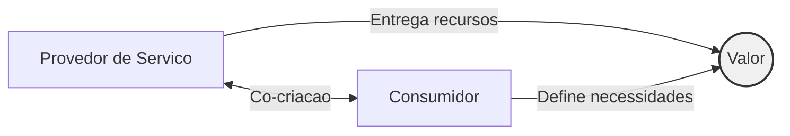
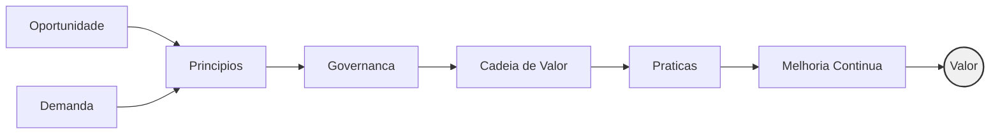
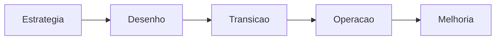
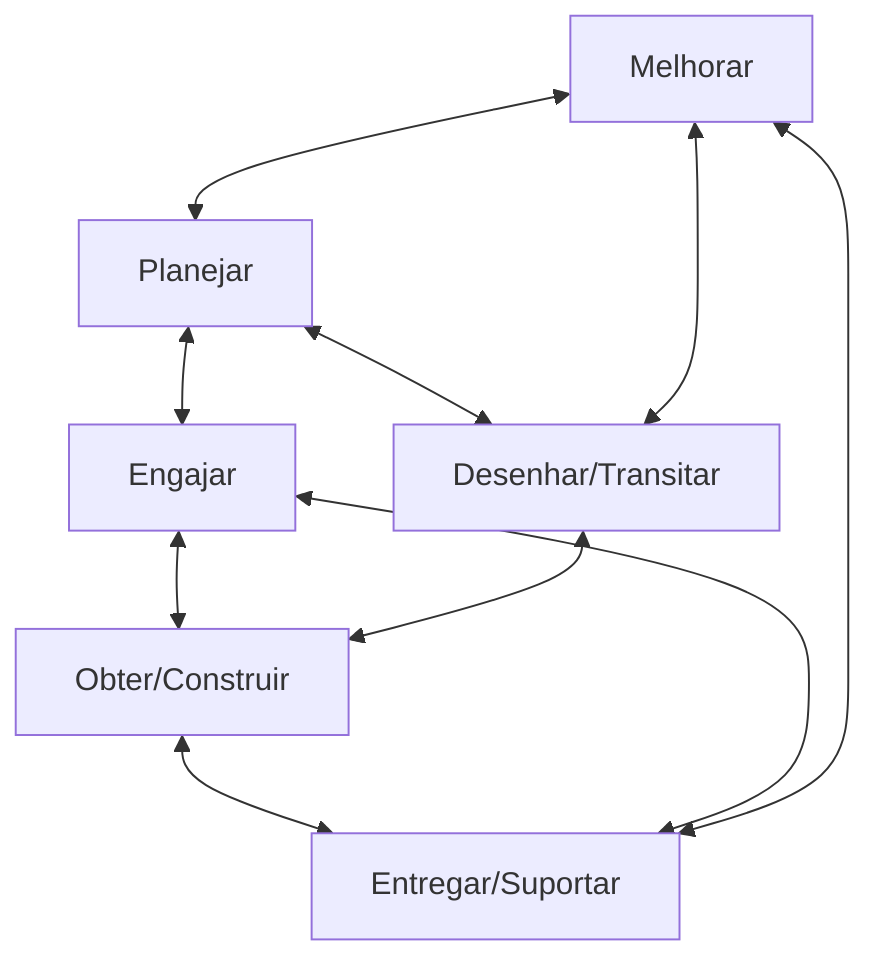
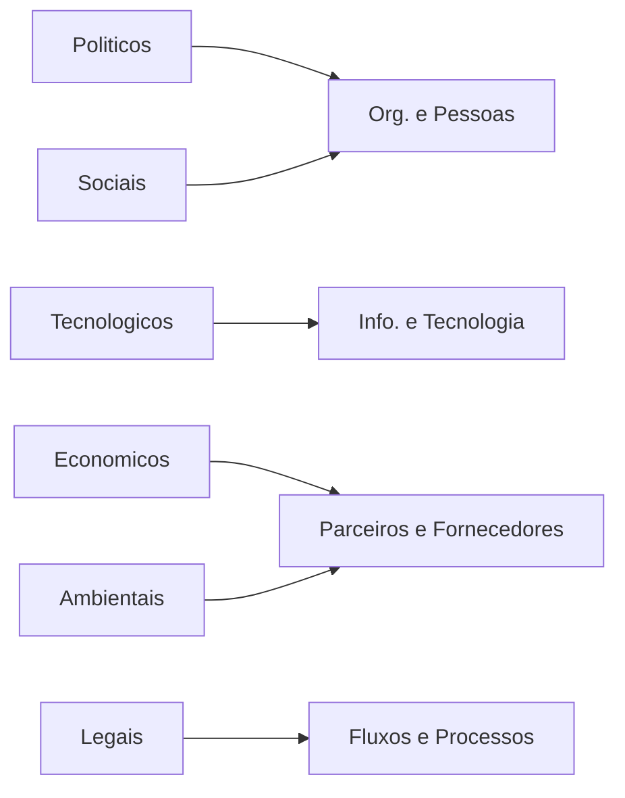
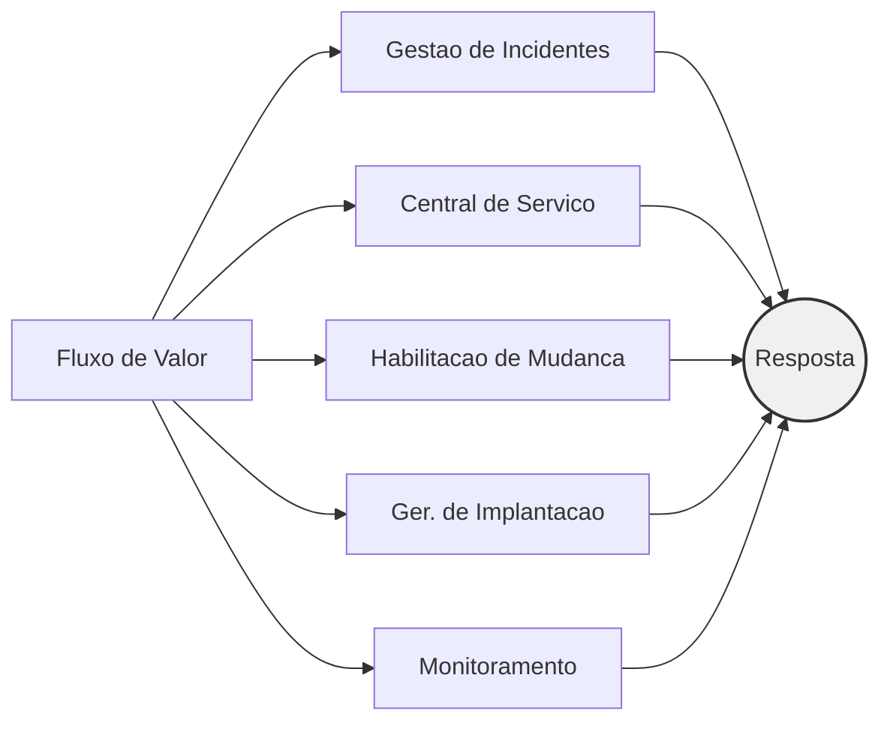
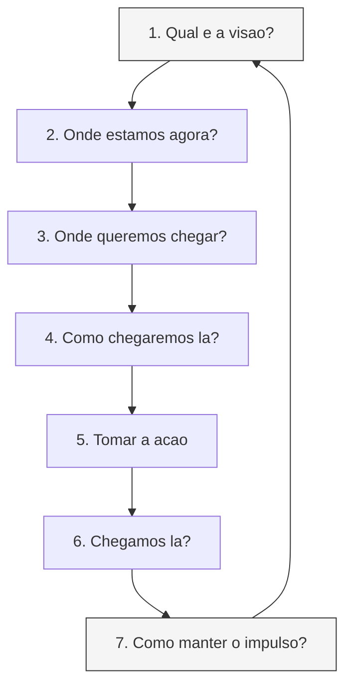

  <h1 class="!text-4xl">Frameworks de Governança e Gestão de TI</h1>
  <h2 class="!text-2xl !mt-2">ITIL v4</h2>
  

    
Filipe Moreira Coelho · Julia Monteiro de Oliveira · Victor Hugo Vieira Cruz

    
Prof.º Ariel Cardoso Mendes | Gestão e Governança em TI

    
Goiânia/GO | 2026/1

  

---
layout: default
---

# Introdução

A **Tecnologia da Informação** deixou de ser suporte operacional e se tornou **recurso estratégico** para inovação e sobrevivência das organizações.

A **Gestão de Serviços de TI (ITSM)** garante que os serviços tecnológicos estejam alinhados às necessidades do negócio, suportando operações e impulsionando a transformação organizacional.

O **ITIL** se consolidou como o framework público **mais reconhecido e adotado mundialmente** para orientar essa gestão.

  

    "A eficácia de um serviço de TI é medida pela sua capacidade de traduzir recursos técnicos em resultados práticos e mensuráveis para o negócio."
  

---
layout: two-cols
layoutClass: gap-12
---

# Do ITIL v3 ao ITIL v4

**ITIL v3/2011** estruturava-se em **5 fases sequenciais** do ciclo de vida:

1. Estratégia de Serviço
2. Desenho de Serviço
3. Transição de Serviço
4. Operação de Serviço
5. Melhoria Contínua

Modelo linear e altamente processual que enfrentou desafios de velocidade frente à rápida evolução do mercado.

::right::

**ITIL v4** representa uma **mudança de paradigma**:

  

    →
    Abandona a visão rígida baseada em ciclo de vida
  

  

    →
    Modelo <strong>ágil, sistêmico e modular</strong>
  

  

    →
    Foco na <strong>co-criação de valor</strong>
  

  

    →
    Integração com <strong>Agile, Lean e DevOps</strong>
  

  

    →
    Governança como <strong>facilitadora</strong>, não como gargalo
  

---
layout: section
---

  Parte 01
  <h1 class="!text-4xl mt-4">O Conceito de Serviço e Valor</h1>
  

---
layout: default
---

# O que é um Serviço?

> Um **serviço** é um meio de permitir a **entrega de valor** aos clientes, facilitando a obtenção dos resultados que desejam alcançar, **sem que precisem assumir custos e riscos específicos**.

### Co-criação de Valor no ITIL v4

O valor **não é uma mercadoria estática** entregue unidirecionalmente. É o resultado de uma **parceria dinâmica e colaborativa** entre provedor, consumidor e demais partes interessadas.

---
layout: default
---

# Utilidade e Garantia

Os dois pilares que sustentam o valor de um serviço

  

    <h3 class="text-xl font-bold mb-1">Utilidade</h3>
    
Fit for Purpose - Adequação ao Propósito

    
<strong>O que</strong> o serviço faz

    

      

        •
        Melhora o desempenho do cliente
      

      

        •
        Remove restrições e limitações
      

      

        •
        Suporta os resultados desejados
      

    

  

  

    <h3 class="text-xl font-bold mb-1">Garantia</h3>
    
Fit for Use - Adequação ao Uso

    
<strong>Como</strong> o serviço é entregue

    

      

        •
        <strong>Disponibilidade</strong> - está acessível quando necessário
      

      

        •
        <strong>Capacidade</strong> - suporta a demanda exigida
      

      

        •
        <strong>Continuidade</strong> - opera em cenários adversos
      

      

        •
        <strong>Segurança</strong> - protege dados e informações
      

    

  

  <strong>Valor = Utilidade + Garantia</strong> - Uma funcionalidade excelente perde seu propósito se não for confiável, segura e escalável.

---
layout: section
---

  Parte 02
  <h1 class="!text-4xl mt-4">O Sistema de Valor de Serviço</h1>
  
Service Value System (SVS)

  

---
layout: default
---

# O que é o SVS?

O **Sistema de Valor de Serviço (SVS)** é a arquitetura central do ITIL v4. Descreve como **todos os componentes e atividades** de uma organização trabalham juntos para habilitar a **criação de valor**.

Propõe uma **visão unificada e flexível** que supera os silos departamentais dos modelos tradicionais.

---
layout: default
---

# Os 5 Componentes do SVS

  1
  

    
Princípios Orientadores

    
Recomendações universais que guiam decisões - focar no valor, pensar holisticamente, otimizar e automatizar.

  

  2
  

    
Governança

    
Alinha operações tecnológicas à direção estratégica - conformidade, segurança, riscos e monitoramento de desempenho.

  

  3
  

    
Cadeia de Valor de Serviço

    
Motor de transformação - 6 atividades interconectadas combináveis de infinitas maneiras.

  

  4
  

    
Práticas de Gestão

    
34 conjuntos de recursos organizacionais - ferramentas, habilidades e procedimentos para trabalhos específicos.

  

  5
  

    
Melhoria Contínua

    
Permeia transversalmente todo o SVS - organismo adaptável que aprende e evolui constantemente.

  

---
layout: default
---

# Os 7 Princípios Orientadores

Bússola comportamental aplicável independente de mudanças em tecnologias ou estruturas

  

    
1. Focar no Valor

    
Tudo deve mapear para valor para as partes interessadas

  

  

    
2. Começar de Onde Está

    
Avaliar o estado atual antes de criar algo novo

  

  

    
3. Progredir Iterativamente com Feedback

    
Iterar com ciclos menores e feedback constante

  

  

    
4. Colaborar e Promover Visibilidade

    
Trabalho colaborativo e transparente gera melhores resultados

  

  

    
5. Pensar e Trabalhar Holisticamente

    
Nenhum serviço ou componente opera isoladamente

  

  

    
6. Manter Simples e Prático

    
Eliminar o que não agrega valor; usar o mínimo de passos

  

  

    
7. Otimizar e Automatizar

    
Maximizar o valor do trabalho humano e automatizar tarefas repetitivas

  

---
layout: section
---

  Parte 03
  <h1 class="!text-4xl mt-4">Cadeia de Valor de Serviço</h1>
  
Service Value Chain

  

---
layout: default
---

# A Ruptura Metodológica

No **ITIL v3**, as práticas eram estruturadas em torno de um **ciclo de vida linear** - uma cascata sequencial que limitava a agilidade.

O **ITIL v4** substitui esse fluxo por um **modelo operacional flexível** em formato de rede, onde os blocos de construção não seguem uma ordem predeterminada.

  

    
ITIL v3 - Linear

  

  

    
ITIL v4 - Rede Flexivel

  

---
layout: default
---

# As 6 Atividades da Cadeia de Valor

  Planejar
  
Assegura visão compartilhada do <strong>status atual</strong> e da <strong>direção estratégica</strong> em toda a organização.

  Melhorar
  
Atua de forma <strong>onipresente</strong> para otimizar o desempenho de todas as outras atividades.

  Engajar
  
Porta de entrada para o relacionamento - garante <strong>compreensão contínua</strong> das necessidades de todas as partes interessadas.

  Desenhar e Transitar
  
Certifica que os serviços atendam às expectativas de <strong>custo, qualidade e tempo</strong> para o lançamento.

  Obter / Construir
  
Lida com <strong>aquisição, codificação ou integração</strong> de componentes reais de infraestrutura e software.

  Entregar e Suportar
  
Garante que os serviços sejam <strong>operados conforme as garantias</strong> acordadas com o cliente.

---
layout: default
---

# Fluxos de Valor - Value Streams

Enquanto a Cadeia de Valor fornece as **peças do quebra-cabeça**, um **Fluxo de Valor** é a sequência específica de passos que a organização orquestra para responder a um **cenário real**.

  

    
Exemplo: Incidente em Produção

    
Queda de banco de dados

    

      

        →
        <strong>Engajar</strong> o usuário
      

      

        →
        <strong>Entregar e Suportar</strong> a correção
      

      
Caminho emergencial e focado

    

  

  

    
Exemplo: Nova Arquitetura

    
Implantação de novo software

    

      

        →
        <strong>Desenhar e Transitar</strong> ciclos iterativos
      

      

        →
        <strong>Obter/Construir</strong> componentes
      

      
Ciclos repetitivos e planejados

    

  

  Essa mecânica garante que os <strong>controles de governança não se tornem burocracias universais</strong>, permitindo adaptação ao contexto de cada demanda em harmonia com metodologias ágeis e CI/CD.

---
layout: section
---

  Parte 04
  <h1 class="!text-4xl mt-4">As 4 Dimensões da Gestão de Serviços</h1>
  

---
layout: default
---

# Visão Holística

Evolução dos antigos "4 Ps" (Pessoas, Produtos, Processos e Parceiros) - agora aplicáveis transversalmente a todo o SVS.

  

    

      1
      <h3 class="font-semibold">Organizações e Pessoas</h3>
    

    
Estruturas organizacionais, papéis, cultura corporativa, competências e canais de comunicação para operação colaborativa.

  

  

    

      2
      <h3 class="font-semibold">Informação e Tecnologia</h3>
    

    
Conhecimento, dados, ferramentas, infraestrutura (cloud, microsserviços), segurança da informação e conformidade regulatória.

  

  

    

      3
      <h3 class="font-semibold">Parceiros e Fornecedores</h3>
    

    
Ecossistema de relacionamentos, contratos de suporte, integração de terceiros e otimização de processos com parceiros externos.

  

  

    

      4
      <h3 class="font-semibold">Fluxos de Valor e Processos</h3>
    

    
Como as partes da organização trabalham coordenadamente - identificar desperdícios, otimizar tarefas e acelerar entregas.

  

---
layout: default
---

# As 4 Dimensões e os Fatores Externos

A gestão de serviços é **constantemente influenciada por pressões externas** que fogem ao controle direto da organização.

  O modelo <strong>PESTLE</strong> mapeia como variáveis externas moldam conformidade regulatória, preferências dos consumidores e restrições financeiras, mantendo as dimensões ágeis e resilientes.

---
layout: section
---

  Parte 05
  <h1 class="!text-4xl mt-4">Práticas de Gestão</h1>
  
A Evolução dos "Processos"

  

---
layout: two-cols
layoutClass: gap-12
---

# De Processos a Práticas

**Antes (ITIL v3)**
- Processo = conjunto estruturado de atividades com entradas e saídas definidas
- Garantia de previsibilidade, mas frequentemente gerava **fluxos isolados e burocráticos**

**Agora (ITIL v4)**
- Prática = conjunto de **recursos organizacionais** desenhados para atingir um objetivo integrado à criação de valor
- Combina: ferramentas tecnológicas + habilidades humanas + procedimentos de fluxo de trabalho

::right::

  
Mudança fundamental

  
Um fluxo de atividades (processo) é <strong>insuficiente</strong> se não for suportado por:

  

    

      

      Habilidades das <strong>pessoas</strong>
    

    

      

      Ferramentas <strong>tecnológicas</strong> adequadas
    

    

      

      <strong>Parceiros</strong> estratégicos
    

  

  
Integra as 4 dimensões em cada unidade de trabalho.

---
layout: default
---

# As 34 Práticas - 3 Categorias

  <h3 class="font-semibold">Práticas Gerais de Gestão</h3>
  
Herdadas de domínios corporativos mais amplos

  
Gestão de estratégia, arquitetura corporativa, gestão de riscos, gestão de portfólio, gestão financeira, gestão de talentos, entre outras.

  <h3 class="font-semibold">Práticas de Gestão de Serviços</h3>
  
Evolução dos processos clássicos de suporte e operação

  
Gerenciamento de incidentes, problemas, requisições, nível de serviço, catálogo de serviços, central de serviço, habilitação de mudança, entre outras.

  

    
<strong>Destaque:</strong> "Gerenciamento de mudanças" → <strong>"Habilitação de Mudança"</strong> (<em>Change Enablement</em>). Viabiliza entregas seguras em CI/CD, abandonando comitês de aprovação demorados.

  

  <h3 class="font-semibold">Práticas de Gestão Técnica</h3>
  
Disciplinas de engenharia integradas ao framework

  
Gerenciamento de implantação, gerenciamento de infraestrutura e plataforma, desenvolvimento e gerenciamento de software.

---
layout: default
---

# Práticas como Blocos Combináveis

As práticas **não operam como etapas sequenciais** - funcionam como um **repositório de recursos e capacidades** que a organização combina dinamicamente para construir seus Fluxos de Valor.

  Cada fluxo de valor seleciona apenas as práticas necessárias - garantindo uma resposta <strong>resiliente e adequada</strong> ao contexto.

---
layout: section
---

  Parte 06
  <h1 class="!text-4xl mt-4">Melhoria Contínua</h1>
  

---
layout: default
---

# Uma Força Onipresente

A Melhoria Contínua **transcende a ideia de etapa conclusiva** - é uma força direcional em toda a organização.

No ITIL v4, ela é simultaneamente:
- Um **componente transversal** do SVS
- Uma **prática de gestão dedicada**

Aplicável a todos os elementos: governança, cadeia de valor, práticas e ferramentas.

> A melhoria **não é um projeto temporário** acionado quando algo falha - é uma **atividade de rotina** incorporada à cultura organizacional.

---
layout: default
---

# Modelo de Melhoria Contínua

Evolução estruturada que contrasta a posição atual com os objetivos de longo prazo

  Em ambientes ágeis e de entrega contínua, esse modelo garante que os fluxos de valor <strong>não fiquem estagnados</strong> - a TI aprende continuamente com seus gargalos e otimiza suas arquiteturas.

---
layout: default
---

# Melhoria Contínua na Prática

  

    
Nível Estratégico

    
Alinhamento entre TI e objetivos de negócio. Revisão de portfólio de serviços.

  

  

    
Nível Tático

    
Otimização de processos e práticas. Revisão de SLAs e indicadores de desempenho.

  

  

    
Nível Operacional

    
Aprimoramento diário de atividades. Análise de incidentes e problemas recorrentes.

  

  
Características-chave:

  

    

      •
      Aprendizado constante com falhas operacionais
    

    

      •
      Otimização contínua de entregas
    

    

      •
      Evolução na velocidade do mercado
    

    

      •
      Registro centralizado de oportunidades (CIR)
    

  

---
layout: default
---

# Conclusão

O **ITIL v4** representa um marco na adequação da gestão de serviços à realidade tecnológica contemporânea.

**Principais transformações:**

  

    →
    De ciclo de vida linear para o <strong>SVS flexível</strong>
  

  

    →
    De entrega unilateral para <strong>co-criação de valor</strong>
  

  

    →
    De processos rígidos para <strong>práticas integradas</strong>
  

  

    →
    De silos departamentais para <strong>4 dimensões holísticas</strong>
  

  

    →
    De melhoria como fase para <strong>melhoria como cultura</strong>
  

  

    →
    De governança como barreira para <strong>governança como facilitadora</strong>
  

  "Governança, alinhamento estratégico com o negócio e inovação tecnológica em alta velocidade podem e devem coexistir harmoniosamente."

